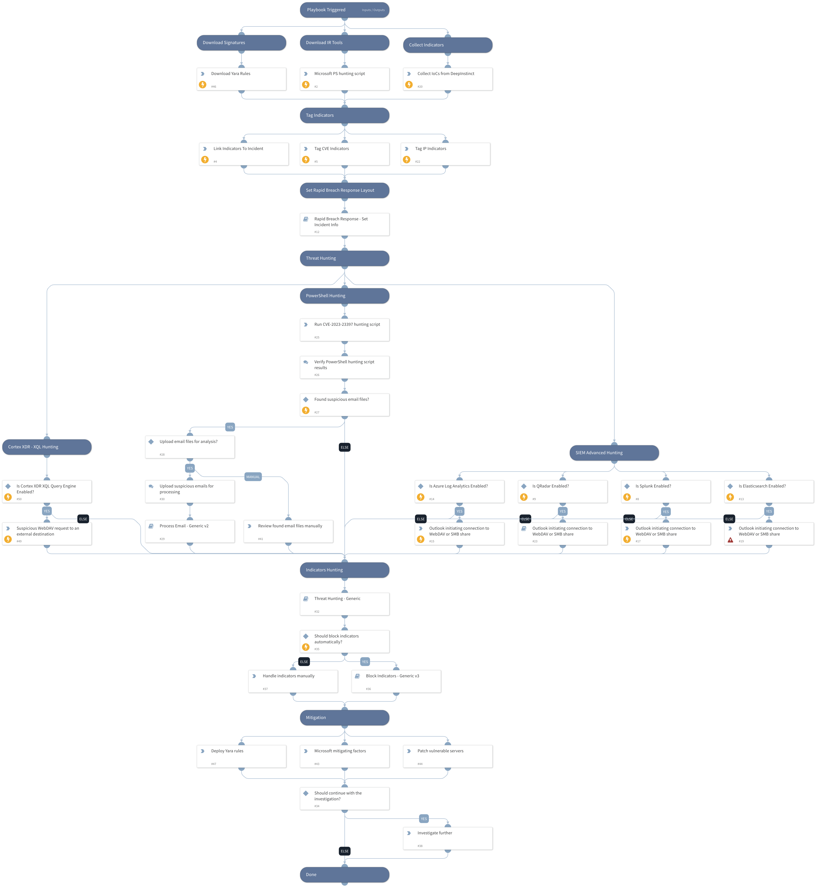

### CVE-2023-23397 - Critical Elevation of Privilege vulnerability in Microsoft Outlook 

#### Summary 
Microsoft Threat Intelligence discovered limited, targeted abuse of a vulnerability in Microsoft Outlook for Windows that allows for new technology LAN manager (NTLM) credential theft. Microsoft has released CVE-2023-23397 to address the critical elevation of privilege (EoP) vulnerability affecting Microsoft Outlook for Windows. We strongly recommend all customers update Microsoft Outlook for Windows to remain secure.

#### Affected Products 
All supported versions of Microsoft Outlook for Windows are affected. Other versions of Microsoft Outlook such as Android, iOS, Mac, as well as Outlook on the web and other M365 services are not affected.

#### Technical Details 
CVE-2023-23397 is a critical EoP vulnerability in Microsoft Outlook that is triggered when an attacker sends a message with an extended MAPI property with a UNC path to an SMB (TCP 445) share on a threat actor-controlled server. No user interaction is required.

The threat actor is using a connection to the remote SMB server sends the user’s NTLM negotiation message, which the attacker can then relay for authentication against other systems that support NTLM authentication.

**This playbook should be triggered manually or can be configured as a job.** 
Please create a new incident and choose the CVE-2023-23397 - Microsoft Outlook EoP  playbook and Rapid Breach Response incident type.

**The playbook includes the following tasks:**

**Hunting:**
- Panorama Threat IDs
- Cortex XDR
 - XQL hunting query
 - BTP hunting
- Microsoft PowerShell hunting script
- Advanced SIEM hunting queries
- Indicators hunting
- Endpoint by CVE hunting

**Mitigations:**
- Cortex XDR Advanced API Monitoring 
- Microsoft official CVE-2023-23397 patch
- Microsoft workarounds
- Detection Rules
    - Yara

**References:**

[Microsoft Mitigates Outlook Elevation of Privilege Vulnerability](https://msrc.microsoft.com/blog/2023/03/microsoft-mitigates-outlook-elevation-of-privilege-vulnerability/)

[CVE-2023-23397 Audit & Eradication Script](https://github.com/microsoft/CSS-Exchange/blob/a4c096e8b6e6eddeba2f42910f165681ed64adf7/docs/Security/CVE-2023-23397.md)

[Neo23x0 Yara Rules](https://github.com/Neo23x0/signature-base/blob/master/yara/expl_outlook_cve_2023_23397.yar)

Note: This is a beta playbook, which lets you implement and test pre-release software. Since the playbook is beta, it might contain bugs. Updates to the pack during the beta phase might include non-backward compatible features. We appreciate your feedback on the quality and usability of the pack to help us identify issues, fix them, and continually improve.

## Dependencies

This playbook uses the following sub-playbooks, integrations, and scripts.

### Sub-playbooks

* Search Endpoint by CVE - Generic
* Outlook initiating connection to WebDAV or SMB share
* Block Indicators - Generic v3
* Threat Hunting - Generic
* Process Email - Generic v2
* Rapid Breach Response - Set Incident Info
* Panorama Query Logs

### Integrations

* Elasticsearch v2

### Scripts

* CreateNewIndicatorsOnly
* ParseHTMLIndicators
* HttpV2

### Commands

* es-eql-search
* xdr-xql-generic-query
* associateIndicatorsToIncident
* xdr-get-alerts
* azure-log-analytics-execute-query
* splunk-search

## Playbook Inputs

---

| **Name** | **Description** | **Default Value** | **Required** |
| --- | --- | --- | --- |
| PlaybookDescription | The playbook description to be used in the Rapid Breach Response - Set Incident Info sub-playbook. | ### CVE-2023-23397 - Critical Elevation of Privilege vulnerability in Microsoft Outlook   #### Summary  Microsoft Threat Intelligence discovered limited, targeted abuse of a vulnerability in Microsoft Outlook for Windows that allows for new technology LAN manager (NTLM) credential theft. Microsoft has released CVE-2023-23397 to address the critical elevation of privilege (EoP) vulnerability affecting Microsoft Outlook for Windows. We strongly recommend all customers update Microsoft Outlook for Windows to remain secure.  #### Affected Products  All supported versions of Microsoft Outlook for Windows are affected. Other versions of Microsoft Outlook such as Android, iOS, Mac, as well as Outlook on the web and other M365 services are not affected.  #### Technical Details  CVE-2023-23397 is a critical EoP vulnerability in Microsoft Outlook that is triggered when an attacker sends a message with an extended MAPI property with a UNC path to an SMB (TCP 445) share on a threat actor-controlled server. No user interaction is required.  The threat actor is using a connection to the remote SMB server sends the user’s NTLM negotiation message, which the attacker can then relay for authentication against other systems that support NTLM authentication.  **This playbook should be triggered manually or can be configured as a job.**  Please create a new incident and choose the CVE-2023-23397 - Microsoft Outlook EoP  playbook and Rapid Breach Response incident type.  **The playbook includes the following tasks:**  **Hunting:** - Panorama Threat IDs - Cortex XDR  - XQL hunting query  - BTP hunting - Microsoft PowerShell hunting script - Advanced SIEM hunting queries - Indicators hunting - Endpoint by CVE hunting  **Mitigations:** - Cortex XDR Advanced API Monitoring  - Microsoft official CVE-2023-23397 patch - Microsoft workarounds - Detection Rules     - Yara  **References:**  [Microsoft Mitigates Outlook Elevation of Privilege Vulnerability](https://msrc.microsoft.com/blog/2023/03/microsoft-mitigates-outlook-elevation-of-privilege-vulnerability/)  [CVE-2023-23397 Audit &amp; Eradication Script](https://github.com/microsoft/CSS-Exchange/blob/a4c096e8b6e6eddeba2f42910f165681ed64adf7/docs/Security/CVE-2023-23397.md)  [Neo23x0 Yara Rules](https://github.com/Neo23x0/signature-base/blob/master/yara/expl_outlook_cve_2023_23397.yar)  Note: This is a beta playbook, which lets you implement and test pre-release software. Since the playbook is beta, it might contain bugs. Updates to the pack during the beta phase might include non-backward compatible features. We appreciate your feedback on the quality and usability of the pack to help us identify issues, fix them, and continually improve. | Optional |
| autoBlockIndicators | Whether to block the indicators automatically. | False | Optional |
| QRadarTimeRange | The time range to search for indicators in the Threat Hunting -  Generic playbook. | LAST 7 DAYS | Optional |
| SplunkEarliestTime | The earliest time to search for indicators in the Threat Hunting -  Generic playbook. | -7d@d | Optional |
| SplunkLatestTime | The latest time to search for indicators in the Threat Hunting -  Generic playbook. | now | Optional |
| XQLTimeRange | The time range for the Cortex XDR XQL query. | 7 days ago | Optional |

## Playbook Outputs

---
There are no outputs for this playbook.

## Playbook Image

---

