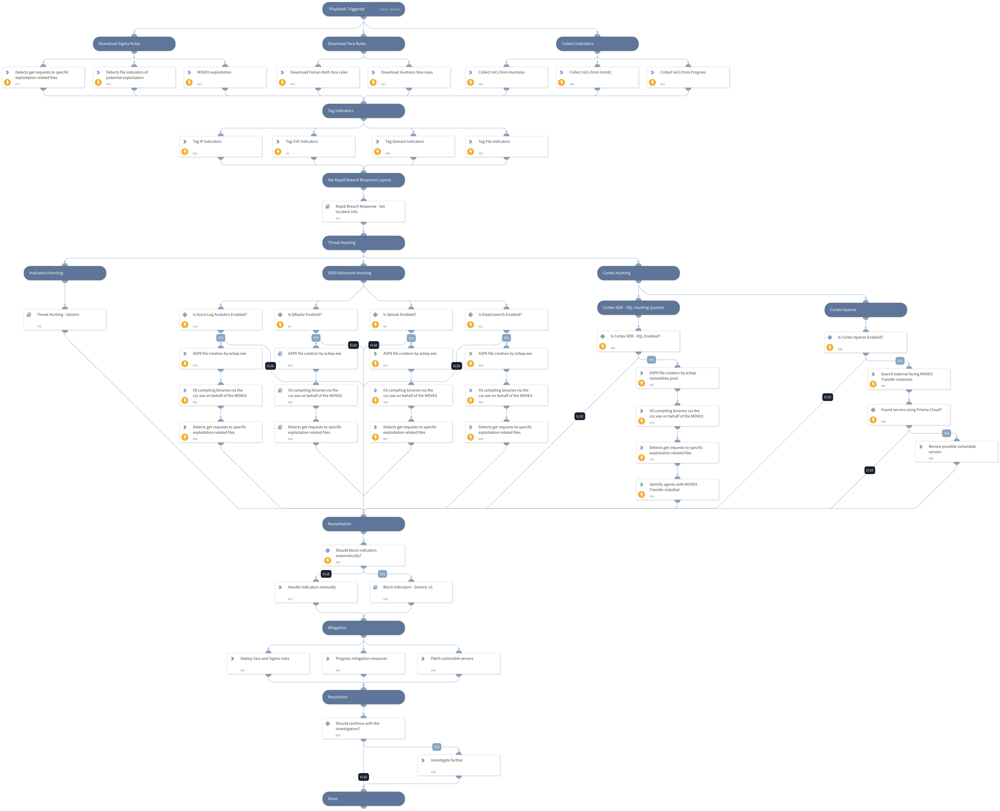

### CVE-2023-34362 - Critical SQL Injection vulnerability in MOVEit Transfer.

#### Summary 

A critical vulnerability has been identified in MOVEit Transfer, a managed file transfer solution. The vulnerability affects versions prior to the latest release and involves improper input validation. Exploiting this vulnerability can lead to remote execution of arbitrary code, potentially resulting in unauthorized access and compromise of sensitive data.

To mitigate the risk associated with this vulnerability, it is crucial for users to update to the latest version of MOVEit Transfer that includes necessary security patches.

#### Affected Products 

| Affected Version               | Fixed Version             | Documentation                       |
|-------------------------------|---------------------------|-------------------------------------|
| MOVEit Transfer 2023.0.0 (15.0) | MOVEit Transfer 2023.0.1 | [MOVEit 2023 Upgrade Documentation](https://docs.ipswitch.com/MOVEit/2023/Upgrade/) |
| MOVEit Transfer 2022.1.x (14.1) | MOVEit Transfer 2022.1.5 | [MOVEit 2022 Upgrade Documentation](https://docs.ipswitch.com/MOVEit/2022/Upgrade/) |
| MOVEit Transfer 2022.0.x (14.0) | MOVEit Transfer 2022.0.4 | [MOVEit 2022 Upgrade Documentation](https://docs.ipswitch.com/MOVEit/2022/Upgrade/) |
| MOVEit Transfer 2021.1.x (13.1) | MOVEit Transfer 2021.1.4 | [MOVEit 2021 Upgrade Documentation](https://docs.ipswitch.com/MOVEit/2021/Upgrade/) |
| MOVEit Transfer 2021.0.x (13.0) | MOVEit Transfer 2021.0.6 | [MOVEit 2021 Upgrade Documentation](https://docs.ipswitch.com/MOVEit/2021/Upgrade/) |
| MOVEit Transfer 2020.1.x (12.1) | Special Patch Available   | See [KB 000234559](https://docs.ipswitch.com/MOVEit/2020/234559.htm) |
| MOVEit Transfer 2020.0.x (12.0) or older | MUST upgrade to a supported version | See [MOVEit Transfer Upgrade and Migration Guide](https://docs.ipswitch.com/MOVEit/Transfer2021/UpgradeGuide/) |

**This playbook should be triggered manually or can be configured as a job.** 

Please create a new incident and choose the CVE-2023-34362 - MOVEit SQL Injection playbook and Rapid Breach Response incident type.

**The playbook includes the following tasks:**

**IoCs Collection**
- Blog IoCs download
- Yara Rules download
- Sigma rules download

**Hunting:**
- Cortex XDR XQL exploitation patterns hunting
- Cortex Xpanse external facing instances hunting
- Advanced SIEM exploitation patterns hunting
- Indicators hunting

The hunting queries are searching for the following activities:
  - ASPX file creation by w3wp.exe
  - IIS compiling binaries via the csc.exe on behalf of the MOVEit
  - Detects get requests to specific exploitation related files

**Mitigations:**
- Progress official CVE-2023-34362 patch
- Progress mitigation measures
- Detection Rules
    - Yara
    - Sigma

**References:**

[CVE-2023-34362: MOVEit Transfer SQL Injection Vulnerability Threat Brief](https://unit42.paloaltonetworks.com/threat-brief-moveit-cve-2023-34362/)

[MOVEit Transfer Critical Vulnerability (May 2023)](https://community.progress.com/s/article/MOVEit-Transfer-Critical-Vulnerability-31May2023)

Note: This is a beta playbook, which lets you implement and test pre-release software. Since the playbook is beta, it might contain bugs. Updates to the pack during the beta phase might include non-backward compatible features. We appreciate your feedback on the quality and usability of the pack to help us identify issues, fix them, and continually improve.

## Dependencies

This playbook uses the following sub-playbooks, integrations, and scripts.

### Sub-playbooks

* Detects get requests to specific exploitation related files
* Rapid Breach Response - Set Incident Info
* Block Indicators - Generic v3
* ASPX file creation by w3wp.exe
* Threat Hunting - Generic
* IIS compiling binaries via the csc.exe on behalf of the MOVEit

### Integrations

This playbook does not use any integrations.

### Scripts

* CreateNewIndicatorsOnly
* HttpV2
* ParseHTMLIndicators

### Commands

* es-eql-search
* splunk-search
* azure-log-analytics-execute-query
* expanse-get-issues
* extractIndicators
* xdr-xql-generic-query

## Playbook Inputs

---

| **Name** | **Description** | **Default Value** | **Required** |
| --- | --- | --- | --- |
| PlaybookDescription | The playbook description to be used in the Rapid Breach Response - Set Incident Info sub-playbook. | ### CVE-2023-34362 - Critical SQL Injection vulnerability in MOVEit Transfer.  #### Summary   A critical vulnerability has been identified in MOVEit Transfer, a managed file transfer solution. The vulnerability affects versions prior to the latest release and involves improper input validation. Exploiting this vulnerability can lead to remote execution of arbitrary code, potentially resulting in unauthorized access and compromise of sensitive data.  To mitigate the risk associated with this vulnerability, it is crucial for users to update to the latest version of MOVEit Transfer that includes necessary security patches.  #### Affected Products    \| Affected Version               \| Fixed Version             \| Documentation                       \| \|-------------------------------\|---------------------------\|-------------------------------------\| \| MOVEit Transfer 2023.0.0 (15.0) \| MOVEit Transfer 2023.0.1 \| [MOVEit 2023 Upgrade Documentation](https://docs.ipswitch.com/MOVEit/2023/Upgrade/) \| \| MOVEit Transfer 2022.1.x (14.1) \| MOVEit Transfer 2022.1.5 \| [MOVEit 2022 Upgrade Documentation](https://docs.ipswitch.com/MOVEit/2022/Upgrade/) \| \| MOVEit Transfer 2022.0.x (14.0) \| MOVEit Transfer 2022.0.4 \| [MOVEit 2022 Upgrade Documentation](https://docs.ipswitch.com/MOVEit/2022/Upgrade/) \| \| MOVEit Transfer 2021.1.x (13.1) \| MOVEit Transfer 2021.1.4 \| [MOVEit 2021 Upgrade Documentation](https://docs.ipswitch.com/MOVEit/2021/Upgrade/) \| \| MOVEit Transfer 2021.0.x (13.0) \| MOVEit Transfer 2021.0.6 \| [MOVEit 2021 Upgrade Documentation](https://docs.ipswitch.com/MOVEit/2021/Upgrade/) \| \| MOVEit Transfer 2020.1.x (12.1) \| Special Patch Available   \| See [KB 000234559](https://docs.ipswitch.com/MOVEit/2020/234559.htm) \| \| MOVEit Transfer 2020.0.x (12.0) or older \| MUST upgrade to a supported version \| See [MOVEit Transfer Upgrade and Migration Guide](https://docs.ipswitch.com/MOVEit/Transfer2021/UpgradeGuide/) \|   **This playbook should be triggered manually or can be configured as a job.**   Please create a new incident and choose the CVE-2023-34362 - MOVEit SQL Injection playbook and Rapid Breach Response incident type.  **The playbook includes the following tasks:**  **IoCs Collection** - Blog IoCs download - Yara Rules download - Sigma rules download  **Hunting:** - Cortex XDR XQL exploitation patterns hunting - Cortex Xpanse external facing instances hunting - Advanced SIEM exploitation patterns hunting - Indicators hunting  The hunting queries are searching for the following activities:   - ASPX file creation by w3wp.exe   - IIS compiling binaries via the csc.exe on behalf of the MOVEit   - Detects get requests to specific exploitation related files  **Mitigations:** - Progress official CVE-2023-34362 patch - Progress mitigation measures - Detection Rules     - Yara     - Sigma   **References:**  [CVE-2023-34362: MOVEit Transfer SQL Injection Vulnerability Threat Brief](https://unit42.paloaltonetworks.com/threat-brief-moveit-cve-2023-34362/)  [MOVEit Transfer Critical Vulnerability (May 2023)](https://community.progress.com/s/article/MOVEit-Transfer-Critical-Vulnerability-31May2023)  Note: This is a beta playbook, which lets you implement and test pre-release software. Since the playbook is beta, it might contain bugs. Updates to the pack during the beta phase might include non-backward compatible features. We appreciate your feedback on the quality and usability of the pack to help us identify issues, fix them, and continually improve. | Optional |
| autoBlockIndicators | Wether to block the indicators automatically. | False | Optional |
| QRadarTimeRange | The time range for the QRadar queries. | Last 10 Days | Optional |
| SplunkEarliestTime | The time range for the Splunk queries. | -10d@d | Optional |
| ElasticEarliestTime | The time range for the Elastic queries. | now-7d/d | Optional |
| LogAnalyticsTimespan | The time range for the Azure Log Analytics queries. | 10d | Optional |
| XQLTimeRange | The time range for the XQL queries. | 2 hours ago | Optional |
| ElasticIndex | The elastic index to search in. |  | Optional |

## Playbook Outputs

---
There are no outputs for this playbook.

## Playbook Image

---

