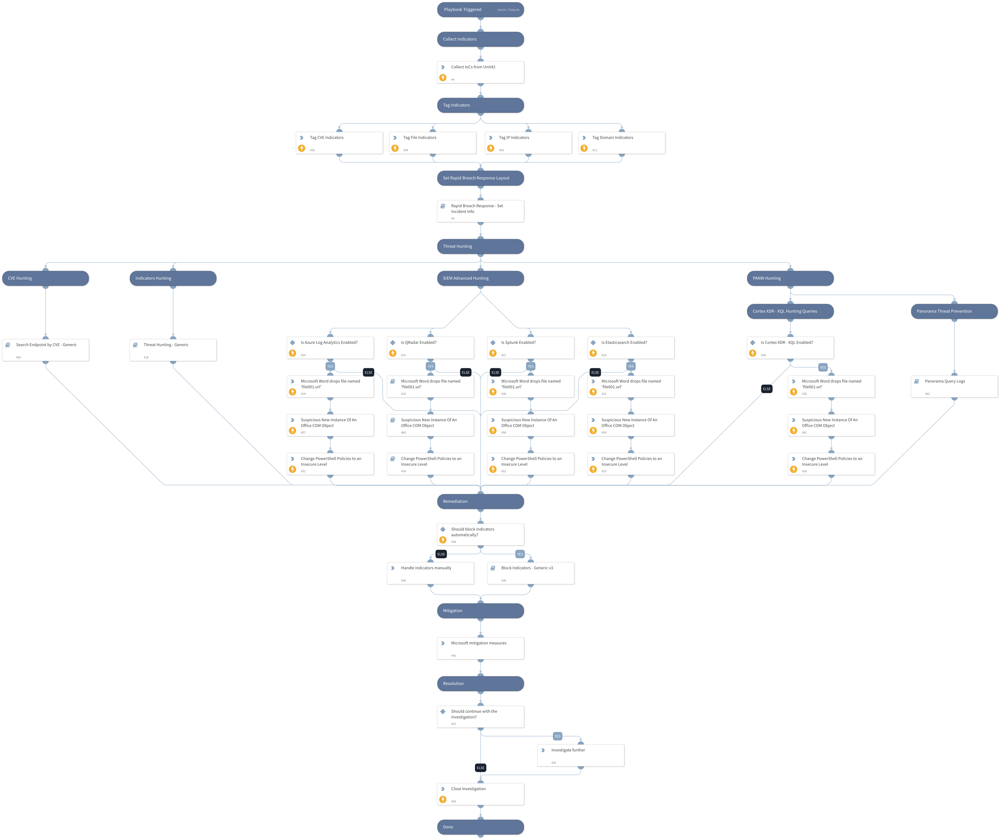

## CVE-2023-36884 - Microsoft Office and Windows HTML RCE

**Summary:**

Microsoft recently detected a sophisticated phishing campaign orchestrated by a threat actor called Storm-0978. The targets of this campaign were defense and government organizations in Europe and North America. The attackers exploited the previously undisclosed CVE-2023-36884, introduced in July's recent Patch Tuesday release.

CVE-2023-36884 is affecting both Office and Windows. This zero-day vulnerability enables remote code execution through specially crafted Microsoft Office documents.

**This playbook should be triggered manually or can be configured as a job.** 

Please create a new incident and choose the CVE-2023-36884 - Office and Windows HTML RCE playbook and Rapid Breach Response incident type.

**The playbook includes the following tasks:**

**IoCs Collection**
- Unit42 IoCs download

**Hunting:**
- PANW Hunting:
  - Cortex XDR XQL exploitation patterns hunting
  - Panorama Threat IDs hunting
- Advanced SIEM exploitation patterns hunting
- Indicators hunting
- Endpoints by CVE hunting

The hunting queries are searching for the following activities:
  - Detects a Microsoft Office file drops a file called 'file001.url'.
  - Suspicious New Instance Of An Office COM Object
  - Change PowerShell Policies to an Insecure Level

`Please note that the threat hunting queries are related to the behavior identified as part of the exploitation patterns and may result in false positive detections.`

**Mitigations:**
- Microsoft mitigation measures

**References:**

[CVE-2023-36884 - Microsoft Office and Windows HTML Remote Code Execution: Threat Brief](https://unit42.paloaltonetworks.com/cve-2023-36884-rce/)
[Storm-0978 attacks reveal financial and espionage motives
](https://www.microsoft.com/en-us/security/blog/2023/07/11/storm-0978-attacks-reveal-financial-and-espionage-motives/)

## Dependencies

This playbook uses the following sub-playbooks, integrations, and scripts.

### Sub-playbooks

* Rapid Breach Response - Set Incident Info
* QRadarFullSearch
* Search Endpoint by CVE - Generic
* Block Indicators - Generic v3
* Threat Hunting - Generic
* Panorama Query Logs

### Integrations

This playbook does not use any integrations.

### Scripts

* CreateNewIndicatorsOnly
* ParseHTMLIndicators

### Commands

* xdr-xql-generic-query
* splunk-search
* closeInvestigation
* azure-log-analytics-execute-query
* es-eql-search

## Playbook Inputs

---

| **Name** | **Description** | **Default Value** | **Required** |
| --- | --- | --- | --- |
| PlaybookDescription | The playbook description to be used in the Rapid Breach Response - Set Incident Info sub-playbook. | ## CVE-2023-36884 - Microsoft Office and Windows HTML RCE  **Summary:**  Microsoft recently detected a sophisticated phishing campaign orchestrated by a threat actor called Storm-0978. The targets of this campaign were defense and government organizations in Europe and North America. The attackers exploited the previously undisclosed CVE-2023-36884, introduced in July's recent Patch Tuesday release.  CVE-2023-36884 is affecting both Office and Windows. This zero-day vulnerability enables remote code execution through specially crafted Microsoft Office documents.  **This playbook should be triggered manually or can be configured as a job.**   Please create a new incident and choose the CVE-2023-36884 - Office and Windows HTML RCE playbook and Rapid Breach Response incident type.  **The playbook includes the following tasks:**  **IoCs Collection** - Unit42 IoCs download  **Hunting:** - PANW Hunting:   - Cortex XDR XQL exploitation patterns hunting   - Panorama Threat IDs hunting - Advanced SIEM exploitation patterns hunting - Indicators hunting - Endpoints by CVE hunting  The hunting queries are searching for the following activities:   - Detects a Microsoft Office file drops a file called 'file001.url'.   - Suspicious New Instance Of An Office COM Object   - Change PowerShell Policies to an Insecure Level  `Please note that the threat hunting queries are related to the behavior identified as part of the exploitation patterns and may result in false positive detections.`  **Mitigations:** - Microsoft mitigation measures  **References:**  [CVE-2023-36884 - Microsoft Office and Windows HTML Remote Code Execution: Threat Brief](https://unit42.paloaltonetworks.com/cve-2023-36884-rce/) [Storm-0978 attacks reveal financial and espionage motives ](https://www.microsoft.com/en-us/security/blog/2023/07/11/storm-0978-attacks-reveal-financial-and-espionage-motives/) | Optional |
| autoBlockIndicators | Wether to block the indicators automatically. | True | Optional |
| QRadarTimeRange | The time range for the QRadar queries. | Last 14 Days | Optional |
| SplunkEarliestTime | The time range for the Splunk queries. | -14d@d | Optional |
| ElasticEarliestTime | The time range for the Elastic queries. | now-14d/d | Optional |
| LogAnalyticsTimespan | The time range for the Azure Log Analytics queries. | 14d | Optional |
| XQLTimeRange | The time range for the XQL queries. | 14 days ago | Optional |
| ElasticIndex | The elastic index to search in. |  | Optional |

## Playbook Outputs

---
There are no outputs for this playbook.

## Playbook Image

---

