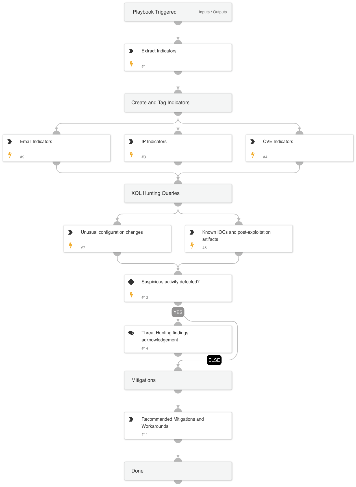

CVE-2024-47575, also known as **FortiJump**, is a critical zero-day vulnerability affecting **FortiManager**, a centralized management platform for Fortinet devices. The vulnerability arises due to missing authentication checks in specific FortiManager REST API endpoints. An unauthenticated attacker with network access to the FortiManager device can exploit this flaw to execute arbitrary code or commands, potentially leading to complete system compromise.

---

## Affected Versions

| FortiManager Version   | Status             |
|------------------------|--------------------|
| **7.2.0 to 7.2.3**     | Affected           |
| **7.0.0 to 7.0.7**     | Affected           |
| **6.4.0 to 6.4.11**    | Affected           |
| **6.2.x and earlier**  | Potentially Affected |
| **7.2.4 and above**    | **Patched**        |
| **7.0.8 and above**    | **Patched**        |
| **6.4.12 and above**   | **Patched**        |

*Note:*

Old FortiAnalyzer models 1000E, 1000F, 2000E, 3000E, 3000F, 3000G, 3500E, 3500F, 3500G, 3700F, 3700G, 3900E with the following feature enabled (FortiManager on FortiAnalyzer):

config system global
set fmg-status enable
end

And at least one interface with the fgfm service enabled is also impacted by this vulnerability.

---

## Playbook Flow

1. Create, Tag, and Block Indicators

2. Hunt **Automatically** for Suspicious Behavior Related to the exploitation flow using XQL
**Note: The 'fortinet_fortimanager_raw' dataset must be available for the XQL queries completion.**

3. Provide Mitigations and Workarounds

---

**References**:

- [Fortinet PSIRT Advisory FG-IR-24-423](https://www.fortiguard.com/psirt/FG-IR-24-423)

---

By following this playbook, organizations can effectively respond to and mitigate the risks associated with **CVE-2024-47575 (FortiJump)**. 

## Dependencies

This playbook uses the following sub-playbooks, integrations, and scripts.

### Sub-playbooks

This playbook does not use any sub-playbooks.

### Integrations

This playbook does not use any integrations.

### Scripts

This playbook does not use any scripts.

### Commands

* createNewIndicator
* extractIndicators
* xdr-xql-generic-query

## Playbook Inputs

---

| **Name** | **Description** | **Default Value** | **Required** |
| --- | --- | --- | --- |
| rawIoCs | FortiGuard Labs IoCs | 195.85.114[.]78, 104.238.141[.]143, 45.32.41[.]202, 158.247.199[.]37, CVE-2024-47575, 0qsc137p@justdefinition[.]com | Optional |

## Playbook Outputs

---
There are no outputs for this playbook.

## Playbook Image

---

