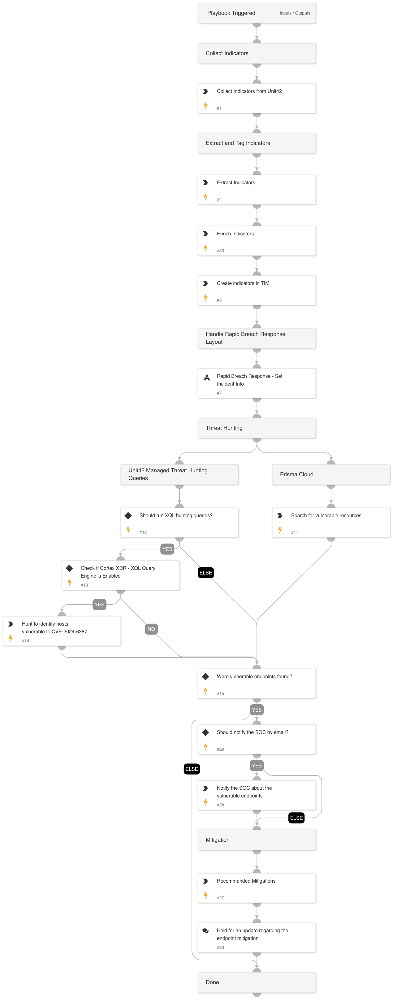

RegreSSHion Vulnerability (CVE-2024-6387)

On July 1, 2024, a critical signal handler race condition vulnerability was disclosed in OpenSSH servers (sshd) on glibc-based Linux systems. This vulnerability, known as RegreSSHion and tracked as CVE-2024-6387, can result in unauthenticated remote code execution (RCE) with root privileges. This vulnerability has been rated High severity (CVSS 8.1).

#### Impacted Versions

The vulnerability impacts the following OpenSSH server versions:

- OpenSSH versions between 8.5p1 and 9.8p1
- OpenSSH versions earlier than 4.4p1, if they have not been backport-patched against CVE-2006-5051 or patched against CVE-2008-4109

#### Unaffected Versions

The SSH features in PAN-OS are not affected by CVE-2024-6387.

### The playbook includes the following tasks:

**Collect, Extract and Enrich Indicators**
* Collect known indicators from Unit42 blog

**Threat Hunting**
* Searches vulnerable endpoints using Prisma Cloud and Cortex XDR - XQL queries

**Mitigations:**
* OpenSSH official CVE-2024-6387 patch
* Unit42 recommended mitigations

**This playbook should be triggered manually or can be configured as a job.** 

Please create a new incident and choose the CVE-2024-6387 - OpenSSH RegreSSHion RCE playbook and Rapid Breach Response incident type.

Reference:

[Threat Brief: CVE-2024-6387 OpenSSH RegreSSHion Vulnerability
](https://unit42.paloaltonetworks.com/threat-brief-cve-2024-6387-openssh/).

Note: This is a beta playbook, which lets you implement and test pre-release software. Since the playbook is beta, it might contain bugs. Updates to the pack during the beta phase might include non-backward compatible features. We appreciate your feedback on the quality and usability of the pack to help us identify issues, fix them, and continually improve.

## Dependencies

This playbook uses the following sub-playbooks, integrations, and scripts.

### Sub-playbooks

* Rapid Breach Response - Set Incident Info

### Integrations

This playbook does not use any integrations.

### Scripts

* ParseHTMLIndicators
* IsIntegrationAvailable
* PrettyPrint

### Commands

* enrichIndicators
* send-mail
* xdr-xql-generic-query
* extractIndicators
* createNewIndicator
* prisma-cloud-compute-ci-scan-results-list

## Playbook Inputs

---

| **Name** | **Description** | **Default Value** | **Required** |
| --- | --- | --- | --- |
| PlaybookDescription | The playbook description to populate the layout with. | RegreSSHion Vulnerability (CVE-2024-6387)  On July 1, 2024, a critical signal handler race condition vulnerability was disclosed in OpenSSH servers (sshd) on glibc-based Linux systems. This vulnerability, known as RegreSSHion and tracked as CVE-2024-6387, can result in unauthenticated remote code execution (RCE) with root privileges. This vulnerability has been rated High severity (CVSS 8.1).  ## Impacted Versions  The vulnerability impacts the following OpenSSH server versions:  - OpenSSH versions between 8.5p1 and 9.8p1 - OpenSSH versions earlier than 4.4p1, if they have not been backport-patched against CVE-2006-5051 or patched against CVE-2008-4109  ## Unaffected Versions  The SSH features in PAN-OS are not affected by CVE-2024-6387. | Optional |
| RunXQLHuntingQueries | Whether to execute the XQL query. | True | Optional |
| ShouldSendMail | Whether to notify the SOC by email. | False | Optional |
| SOCEmailAddress | The email address to notify |  | Optional |

## Playbook Outputs

---
There are no outputs for this playbook.

## Playbook Image

---

