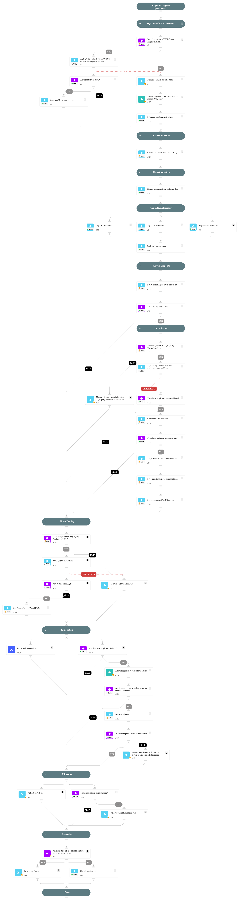

This playbook should be triggered manually or can be configured as a job. Please create a new incident and choose the Cortex XDR - CVE-2025-59287 - Microsoft WSUS Remote Code Execution playbook and Rapid Breach Response incident type.

##   CVE-2025-59287 - Microsoft WSUS Remote Code Execution

##   Vulnerability Overview

- **Vulnerability Name**: Microsoft Windows Server Update Service (WSUS) Deserialization of Untrusted Data Vulnerability
- **CVE ID**: CVE-2025-59287 
- **CVSS Score**: 9.8 (Critical)  

An unauthenticated remote code execution (RCE) vulnerability has been identified in Microsoft Windows Server Update Services (WSUS).
[Source: Unit42 - Palo Alto Networks](https://unit42.paloaltonetworks.com/microsoft-cve-2025-59287/)

##  Mitigation and Recommendations

- **Apply Patch**
- **Restrict Access** to the vulnerable serves  
- **Monitor for IoCs and suspicious traffic**  

##  Conclusion

CVE‑2025‑59287 is a critical, remotely exploitable vulnerability in WSUS that allows unauthenticated attackers to execute arbitrary code with SYSTEM privileges.

[View official CVE details on NIST](https://nvd.nist.gov/vuln/detail/CVE-2025-59287)

##  Playbook Triggers
- Manually

##  Playbook Flow
1. Uses XQL to identify WSUS servers in your environment.
2. Collects IOCs from the Unit42 blog.
3. Uses XQL to detect any suspicious command lines indicative of exploitation of this vulnerability.
4. Investigates the command lines to identify malicious indicators related to the vulnerability.
5. Uses XQL to hunt for malicious IOCs.
6. Isolates compromised WSUS servers.
7. Blocks malicious indicators using the "Block Indicators - Generic v3" playbook.
8. Provides mitigation recommendations.

## Dependencies

This playbook uses the following sub-playbooks, integrations, and scripts.

### Sub-playbooks

* Block Indicators - Generic v3

### Integrations

This playbook does not use any integrations.

### Scripts

* CommandLineAnalysis
* IsIntegrationAvailable
* ParseHTMLIndicators
* SetAndHandleEmpty
* isolate-endpoint

### Commands

* associateIndicatorsToIncident
* closeInvestigation
* createNewIndicator
* extractIndicators
* setIncident
* xdr-xql-generic-query

## Playbook Inputs

---
There are no inputs for this playbook.

## Playbook Outputs

---
There are no outputs for this playbook.

## Playbook Image

---

