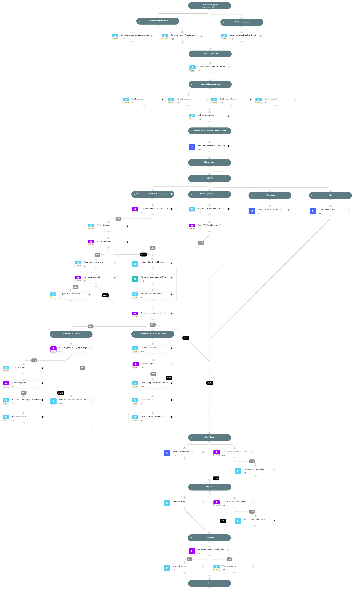

This playbook should be triggered manually or can be configured as a job.
Please create a new incident and choose the CVE-2025-31324 - SAP NetWeaver Visual Composer playbook and Rapid Breach Response incident type.

CVE-2025-31324 is a critical zero-day vulnerability affecting the Metadata Uploader component of SAP NetWeaver Visual Composer. The vulnerability arises from missing authorization checks, allowing unauthenticated attackers to upload malicious executable binaries. Exploitation of this flaw can lead to full remote code execution (RCE) on affected systems, posing a significant risk to confidentiality, integrity, and availability.

## CVE-2025-31324 - SAP NetWeaver RCE Vulnerability

##   Vulnerability Overview

- **Component Affected**: SAP NetWeaver Visual Composer Metadata Uploader  
- **Endpoint**: `/developmentserver/metadatauploader`  
- **CVE ID**: CVE-2025-31324  
- **CVSS Score**: 10.0 (Critical)  
- **Exploitability**: Unauthenticated remote attackers can exploit this without user interaction  

This flaw allows unauthenticated attackers to upload arbitrary files (e.g., JSP web shells), enabling remote code execution with the same privileges as the SAP application server process.  
[Source: Unit42 - Palo Alto Networks](https://unit42.paloaltonetworks.com/threat-brief-sap-netweaver-cve-2025-31324/)

##  Mitigation and Recommendations

- **Apply Patch**: SAP Note #3594142 (released April 24, 2025)  
- **Disable Visual Composer** if not in use  
- **Restrict Access** to the vulnerable endpoint  
- **Monitor for IoCs** in `/irj/servlet_jsp/irj/root/` and suspicious traffic  

##  Conclusion

CVE-2025-31324 is actively exploited and is critically severe. Organizations should patch immediately, monitor for compromise, and disable or restrict vulnerable components.

[View official CVE details on NIST](https://nvd.nist.gov/vuln/detail/CVE-2025-31324)

##  Playbook Triggers
- Manually
- "CVE Exploitation - 986328356" Agent rule

##  Playbook Flow
1. Using XQL, identify potential SAP NetWeaver instances in your environment.
2. Using XQL, check if there are events that point to any potential webshells downloaded in the directories.
3. Directory enumeration to identify if there are already any suspicious files that might indicate a webshell.
4. *Collect* IOCs from a Unit42 blog, *search* them using the "Threat Hunting - Generic" playbook (supports Palo Alto networks products, Qradar, and Splunk), and *block* those indicators using the "Containment Plan - Block Indicators" playbook.
5. Download Sigma rules.
6. Provides Mitigation recommendations.

Note: This is a beta playbook, which lets you implement and test pre-release software. Since the playbook is beta, it might contain bugs. Updates to the pack during the beta phase might include non-backward compatible features. We appreciate your feedback on the quality and usability of the pack to help us identify issues, fix them, and continually improve.

## Dependencies

This playbook uses the following sub-playbooks, integrations, and scripts.

### Sub-playbooks

* Block Indicators - Generic v3
* Rapid Breach Response - Set Incident Info
* Search logs for related sessions
* Threat Hunting - Generic

### Integrations

This playbook does not use any integrations.

### Scripts

* IsIntegrationAvailable
* ParseHTMLIndicators
* SearchIncidentsV2
* SetAndHandleEmpty
* http

### Commands

* associateIndicatorsToIncident
* closeInvestigation
* createNewIndicator
* extractIndicators
* setIncident
* xdr-get-cloud-original-alerts
* xdr-get-script-execution-results
* xdr-script-commands-execute
* xdr-xql-generic-query
* xdr-xql-get-quota

## Playbook Inputs

---

| **Name** | **Description** | **Default Value** | **Required** |
| --- | --- | --- | --- |
| SplunkEarliestTime | The earliest time for Splunk query. | -7d@d | Optional |
| SplunkLatestTime | The latest time for the Splunk search query. | now | Optional |
| QRadarTimeRange | The time range for QRadar query. | Last 7 DAYS | Optional |
| xdr_alert_id | Unique ID for the XDR alert. |  | Optional |
| PlaybookDescription | The playbook description for the Rapid Breach Response layout. | This playbook should be triggered manually or can be configured as a job. Please create a new incident and choose the CVE-2025-31324 - SAP NetWeaver Visual Composer playbook and Rapid Breach Response incident type.  CVE-2025-31324 is a critical zero-day vulnerability affecting the Metadata Uploader component of SAP NetWeaver Visual Composer. The vulnerability arises from missing authorization checks, allowing unauthenticated attackers to upload malicious executable binaries. Exploitation of this flaw can lead to full remote code execution (RCE) on affected systems, posing a significant risk to confidentiality, integrity, and availability.  ## CVE-2025-31324 - SAP NetWeaver RCE Vulnerability  ##   Vulnerability Overview  - **Component Affected**: SAP NetWeaver Visual Composer Metadata Uploader   - **Endpoint**: `/developmentserver/metadatauploader`   - **CVE ID**: CVE-2025-31324   - **CVSS Score**: 10.0 (Critical)   - **Exploitability**: Unauthenticated remote attackers can exploit this without user interaction    This flaw allows unauthenticated attackers to upload arbitrary files (e.g., JSP web shells), enabling remote code execution with the same privileges as the SAP application server process.   [Source: Unit42 - Palo Alto Networks](https://unit42.paloaltonetworks.com/threat-brief-sap-netweaver-cve-2025-31324/)   ##  Mitigation and Recommendations  - **Apply Patch**: SAP Note #3594142 (released April 24, 2025)   - **Disable Visual Composer** if not in use   - **Restrict Access** to the vulnerable endpoint   - **Monitor for IoCs** in `/irj/servlet_jsp/irj/root/` and suspicious traffic    ##  Conclusion  CVE-2025-31324 is actively exploited and is critically severe. Organizations should patch immediately, monitor for compromise, and disable or restrict vulnerable components.  [View official CVE details on NIST](https://nvd.nist.gov/vuln/detail/CVE-2025-31324)  ##  Playbook Triggers - Manually - "CVE Exploitation - 986328356" Agent rule  ##  Playbook Flow 1. Using XQL, identify potential SAP NetWeaver instances in your environment. 2. Using XQL, check if there are events that point to any potential webshells downloaded in the directories. 3. Directory enumeration to identify if there are already any suspicious files that might indicate a webshell. 4. *Collect* IOCs from a Unit42 blog, *search* them using the "Threat Hunting - Generic" playbook (supports Palo Alto networks products, Qradar, and Splunk), and *block* those indicators using the "Containment Plan - Block Indicators" playbook. 5. Download Sigma rules. 6. Provides Mitigation recommendations.  Note: This is a beta playbook, which lets you implement and test pre-release software. Since the playbook is beta, it might contain bugs. Updates to the pack during the beta phase might include non-backward compatible features. We appreciate your feedback on the quality and usability of the pack to help us identify issues, fix them, and continually improve. | Optional |

## Playbook Outputs

---
There are no outputs for this playbook.

## Playbook Image

---

