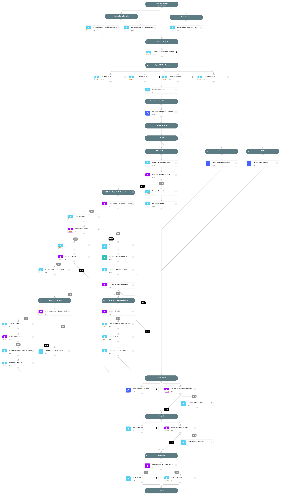

This pack is part of the [Rapid Breach Response](https://xsoar.pan.dev/marketplace/details/MajorBreachesInvestigationandResponse) pack.

**CVE-2025-31324** is a critical zero-day vulnerability in the **Metadata Uploader** component of **SAP NetWeaver Visual Composer**. The flaw stems from missing authorization checks, letting unauthenticated attackers upload malicious binaries. Successful exploitation can lead to full remote-code execution (RCE), jeopardising confidentiality, integrity, and availability.

Unauthenticated attackers can upload arbitrary files (for example, JSP web shells) and gain code-execution with the privileges of the SAP application-server process.

*References*  
[Unit 42 threat brief](https://unit42.paloaltonetworks.com/threat-brief-sap-netweaver-cve-2025-31324/)  
[NIST NVD entry](https://nvd.nist.gov/vuln/detail/CVE-2025-31324)

