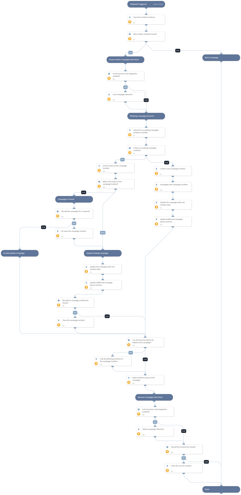

This playbook is used to find, create and manage phishing campaigns. When a number of similar phishing incidents exist in the system, the playbook can be used to do the following:
1. Find and link related incidents to the same phishing attack (a phishing campaign).
2. Search for an existing Phishing Campaign incident, or create a new incident for the linked Phishing incidents.
3. Link all detected phishing incidents to the Phishing Campaign incident that was found or that was created previously.
4. Update the Phishing Campaign incident with the latest data about the campaign, and update all related phishing incidents to indicate that they are part of the campaign.

## Dependencies
This playbook uses the following sub-playbooks, integrations, and scripts.

### Sub-playbooks
This playbook does not use any sub-playbooks.

### Integrations
This playbook does not use any integrations.

### Scripts
* SetPhishingCampaignDetails
* IsIntegrationAvailable
* IsIncidentPartOfCampaign
* SetByIncidentId
* FindEmailCampaign

### Commands
* linkIncidents
* createNewIncident
* demisto-lock-release
* closeInvestigation
* investigate
* demisto-lock-get
* setIncident

## Playbook Inputs
---

| **Name** | **Description** | **Default Value** | **Required** |
| --- | --- | --- | --- |
| AutomaticallyLinkIncidents | Whether to automatically link the incidents that make up the campaign, to the phishing campaign incident. Can be True \(default\) or False. It is recommended not to change the default. | True | Optional |
| incidentTypeFieldName | The name of the incident field in which the incident type is stored. Default is "type". Change this argument only if you're using a custom field for specifying the incident type. | type | Optional |
| incidentTypes | A comma-separated list of incident types by which to filter. Specify "None" to search through all incident types By default, the value is "Phishing" because the Phishing incident type is used out of the box. | Phishing | Optional |
| existingIncidentsLookback | The date from which to search for similar incidents. Date format is the same as in the incidents query page. For example: "3 days ago", "2019-01-01T00:00:00 \+0200". | 7 days ago | Optional |
| query | Additional text by which to query incidents to find similar Phishing incidents. Uses the same language to query incidents in the UI. |  | Optional |
| limit | The maximum number of incidents to fetch. Determines how many incidents can be checked for similarity at the time of execution. | 1000 | Optional |
| emailSubject | The name of the incident field that contains the email subject. By default this is \`emailsubject\` \(because the email subject is stored under \`$\{incident.emailsubject\}\`. | emailsubject | Optional |
| emailBody | The name of the incident field that contains the email body. | emailbody | Optional |
| emailBodyHTML | The name of the incident field that contains the HTML version of the email body. | emailbodyhtml | Optional |
| emailFrom | The name of the incident field that contains the email sender. | emailfrom | Optional |
| statusScope | Whether to compare the new incident to closed incidents, non closed incidents, or all incidents. Can be "All", "ClosedOnly", or "NonClosedOnly". Default is "All". | All | Optional |
| threshold | The threshold to consider an incident as similar. The range of values is 0-1. If needed, make small adjustments and continue to evaluate the required value. It is recommended not to change the default value of \`0.8\`.\| | 0.8 | Optional |
| maxIncidentsToReturn | The maximum number of incidents to display as part of a campaign. If a campaign includes a higher number of incidents, the results will contain only these amounts of incidents. | 200 | Optional |
| minIncidentsForCampaign | The minimum number of incidents to consider as a campaign. For example, if you specify \`10\`, but only \`9\` similar incidents are found, the script will not find them as part of a campaign.\| | 3 | Optional |
| minUniqueRecipients | The minimum number of unique recipients of similar email incidents to consider as a campaign. as a campaign. | 2 | Optional |
| fieldsToDisplay | A comma-separated list of fields to display. For example, "emailclassification,closereason". If a list of fields is provided, and a campaign is detected, these incidents fields will be displayed. Note - removing the "emailfrom", "recipients", or "severity" fields from this list will affect dynamic sections displayed in the campaign layout and render them useless. | id,name,similarity,emailfrom,recipients,severity,status,occurred | Optional |
| AutomaticallyCloseIncidents | Whether to automatically close the incidents that make up the campaign. Can be True or False. | False | Optional |

## Playbook Outputs
---
There are no outputs for this playbook.

## Playbook Image
---
