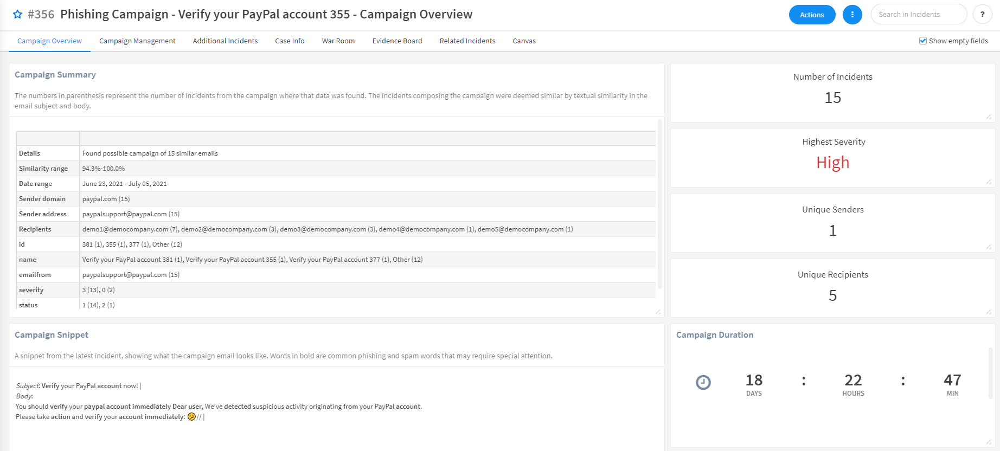
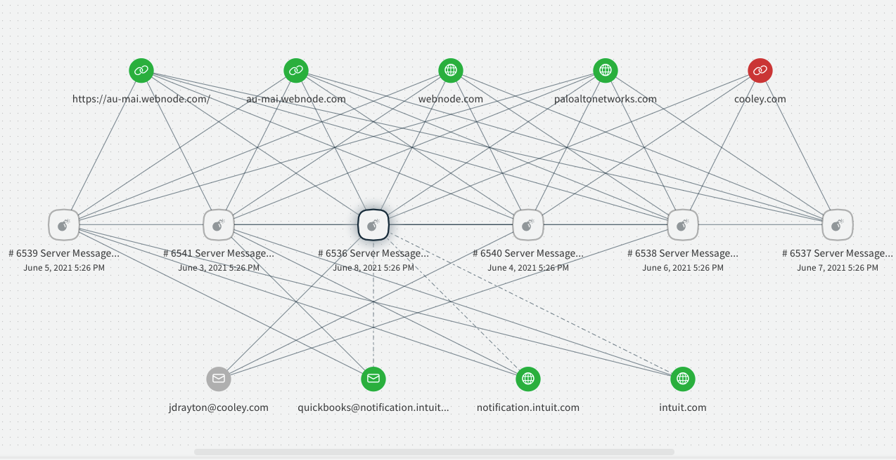

When a suspicious email is detected, you can use this pack to determine whether the email is part of a bigger phishing campaign, and to understand its scale and potential risks.

## What does this pack do?

The pack includes the **FindEmailCampaign** script which enables you to: 
- Filter past email incidents according to multiple search criteria such as incident types, email body and/or subject, email sender and more.
- Define criteria for a collection of related email incidents to be considered a campaign: minimum number of incidents, minimum number of unique recipients and machine-learning driven similarity threshold between emails.

The script output indicates whether a campaign was identified. When a campaign is identified, more information about the campaign is provided: number of incidents involved in the campaign, indicators involved in the campaign and more.
This allows the user to take additional steps on the campaign findings, like blocking the email of the campaign sender or notifying the email recipients about the campaign.

## How does this pack work?

- You can use the FindEmailCampaign script from this pack on any existing email incident to search through past incidents of the same type and identify campaigns.
- You can use the data gathered from the FindEmailCampaign script to close existing incidents as duplicates and to let the recipients know about the detected campaign.
- You can use the data gathered from the FindEmailCampaign script to identify malicious indicators used in the campaign and block them.
- The pack expects you to have pre-existing email incidents created from a mail listener such as EWS v2.
- The Phishing content pack is required because the **FindEmailCampaign** script uses the **FindDuplicateEmailIncidents** script from that pack.

_For more information, visit our [Cortex XSOAR Developer Docs](https://xsoar.pan.dev/docs/reference/packs/phishing-campaign)._

