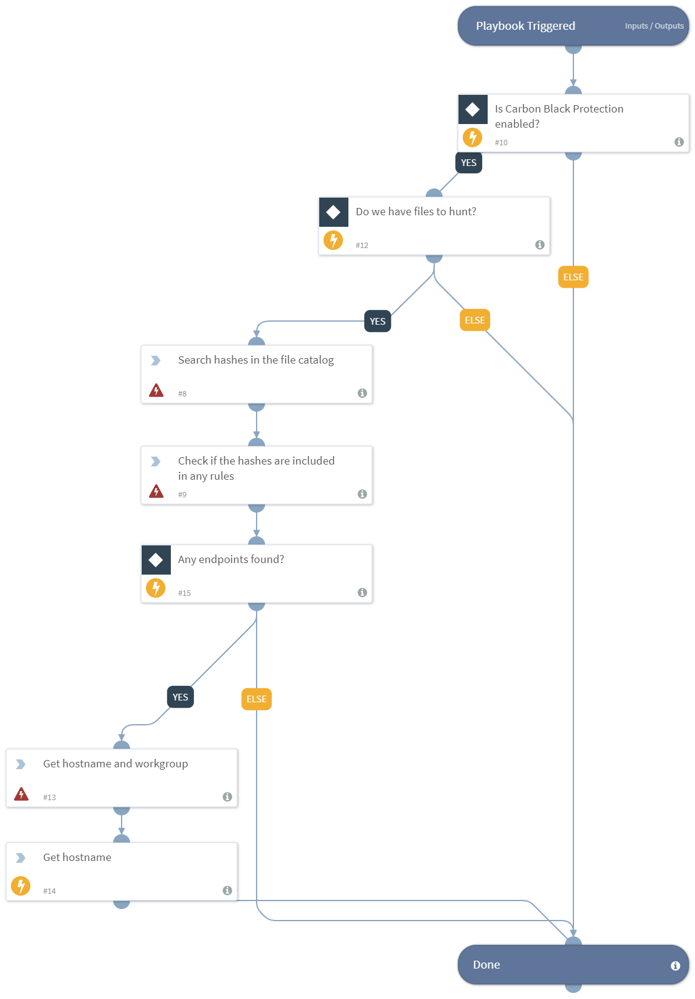

Hunts for endpoint activity involving hash IOCs, using Carbon Black Protection.

## Dependencies
This playbook uses the following sub-playbooks, integrations, and scripts.

### Sub-playbooks
This playbook does not use any sub-playbooks.

### Integrations
* carbonblackprotection

### Scripts
* CBPCatalogFindHash
* Exists
* CBPFindRule
* Set

### Commands
* cbp-computer-get

## Playbook Inputs
---

| **Name** | **Description** | **Default Value** | **Source** | **Required** |
| --- | --- | --- | --- | --- |
| Hash | The MD5 file Hash to hunt for. | MD5 | File | Optional |

## Playbook Outputs
---

| **Path** | **Description** | **Type** |
| --- | --- | --- |
| Endpoint.Hostname | The device hostname. | string |
| Endpoint | The endpoint. | unknown |

## Playbook Image
---

