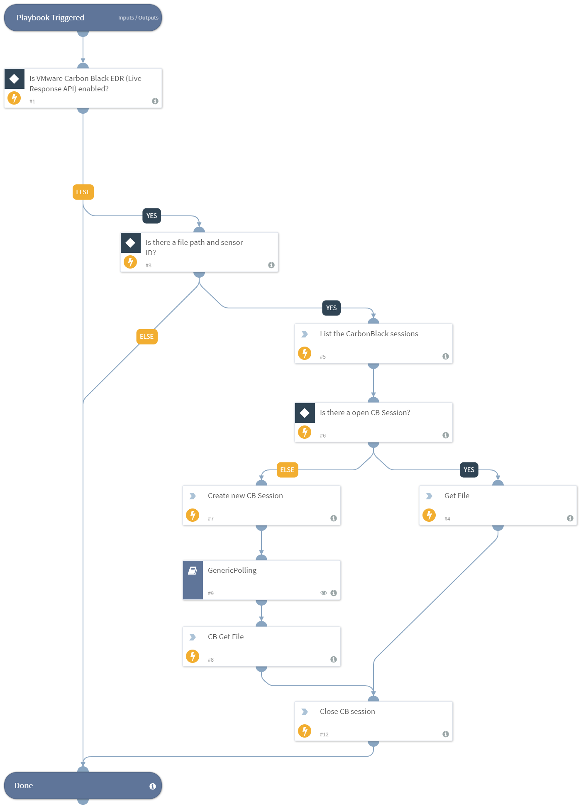

This playbook retrieves a file from endpoints by path using VMware Carbon Black EDR (Live Response API).
Make sure to provide the Carbon Black sensor ID of the endpoint from which you want to retrieve the file.

## Dependencies
This playbook uses the following sub-playbooks, integrations, and scripts.

### Sub-playbooks
GenericPolling

### Integrations
* carbonblackliveresponse
* integration-Carbon_Black_Enterprise_Live_Response

### Scripts
Exists

### Commands
* cb-get-file-from-endpoint
* cb-session-create
* cb-list-sessions
* cb-session-close

## Playbook Inputs
---

| **Name** | **Description** | **Default Value** | **Required** |
| --- | --- | --- | --- |
| Sensor_ID | The sensor ID. Provide the sensor ID to run the command with a new session. The session will be created and closed automatically. |  | Optional |
| Path | The path of the file to retrieve. For example: C:\\users\\folder\\file.txt |  | Optional |

## Playbook Outputs
---

| **Path** | **Description** | **Type** |
| --- | --- | --- |
| File.Size | The size of the file. | number |
| File.Type | The type of the file. | string |
| File.Info | General information of the file. | string |
| File.MD5 | The MD5 hash of the file. | string |
| File.SHA1 | The SHA1 hash of the file. | string |
| File.SHA256 | The SHA256 hash of the file. | string |
| File.SHA512 | The SHA512 hash of the file. | string |
| File.SSDeep | The file SSDeep. | string |
| File.Name | The file name. | string |
| File.EntryID | File entry ID. | string |
| File.Extension | The file extension. | string |

## Playbook Image
---

