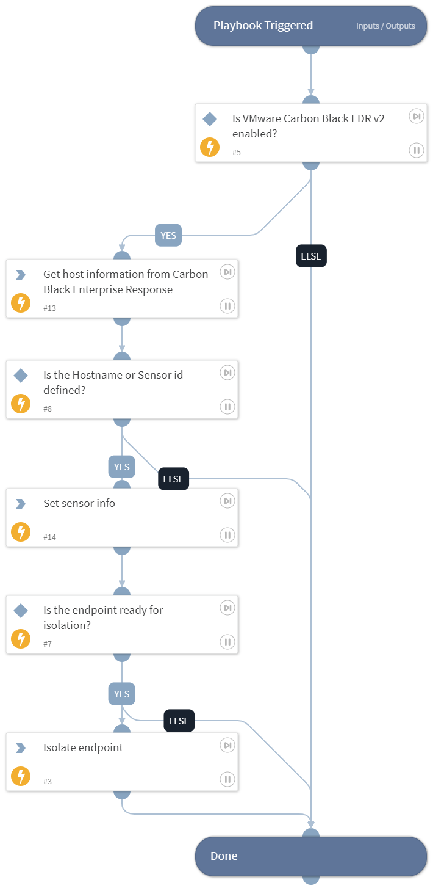

Carbon Black Response - isolates an endpoint for a given hostname.

## Dependencies

This playbook uses the following sub-playbooks, integrations, and scripts.

### Sub-playbooks

This playbook does not use any sub-playbooks.

### Integrations

CarbonBlackResponseV2

### Scripts

* IsIntegrationAvailable
* Set

### Commands

* cb-edr-sensors-list
* cb-edr-quarantine-device

## Playbook Inputs

---

| **Name** | **Description** | **Default Value** | **Required** |
| --- | --- | --- | --- |
| Hostname | The hostname to isolate. | WIN1 | Optional |
| Sensor_id | The sensor ID of the endpoint. |  | Optional |

## Playbook Outputs

---

| **Path** | **Description** | **Type** |
| --- | --- | --- |
| CarbonBlackEDR.Sensor | The sensor info. | unknown |
| CarbonBlackEDR.Sensor.systemvolume_total_size | The size, in bytes, of the system volume of the endpoint on which the sensor is installed.
| CarbonBlackEDR.Sensor.emet_telemetry_path | The path of the EMET telemetry associated with the sensor. | unknown |
| CarbonBlackEDR.Sensor.os_environment_display_string | Human-readable string of the installed OS. | unknown |
| CarbonBlackEDR.Sensor.emet_version | The EMET version associated with the sensor. | unknown |
| CarbonBlackEDR.Sensor.emet_dump_flags | The flags of the EMET dump associated with the sensor. | unknown |
| CarbonBlackEDR.Sensor.clock_delta | The clock delta associated with the sensor. | unknown |
| CarbonBlackEDR.Sensor.supports_cblr | Whether the sensor supports Carbon Black Live Response (CbLR). | unknown |
| CarbonBlackEDR.Sensor.sensor_uptime | The uptime of the process. | unknown |
| CarbonBlackEDR.Sensor.last_update | When the sensor was  last updated. | unknown |
| CarbonBlackEDR.Sensor.physical_memory_size | The size in bytes of physical memory. | unknown |
| CarbonBlackEDR.Sensor.build_id | The sensor version installed on this endpoint. From the /api/builds/ endpoint. | unknown |
| CarbonBlackEDR.Sensor.uptime | Endpoint uptime in seconds. | unknown |
| CarbonBlackEDR.Sensor.is_isolating | Boolean representing sensor-reported isolation status. | unknown |
| CarbonBlackEDR.Sensor.event_log_flush_time | If event_log_flush_time is set, the server will instruct the sensor to immediately send all data before this date, ignoring all other throttling mechanisms. To force a host current, set this value to a value far in the future. When the sensor has finished sending its queued data, this value will be null. | unknown |
| CarbonBlackEDR.Sensor.computer_dns_name | The DNS name of the endpoint on which the sensor is installed. | unknown |
| CarbonBlackEDR.Sensor.emet_report_setting | The report setting of the EMET associated with the sensor. | unknown |
| CarbonBlackEDR.Sensor.id | The ID of this sensor. | unknown |
| CarbonBlackEDR.Sensor.emet_process_count | The number of EMET processes associated with the sensor. | unknown |
| CarbonBlackEDR.Sensor.emet_is_gpo | Whether the EMET is a GPO. | unknown |
| CarbonBlackEDR.Sensor.power_state | The sensor power state. | unknown |
| CarbonBlackEDR.Sensor.network_isolation_enabled | Boolean representing the network isolation request status. | unknown |
| CarbonBlackEDR.Sensor.systemvolume_free_size | The amount of free bytes on the system volume. | unknown |
| CarbonBlackEDR.Sensor.status | The sensor status. | unknown |
| CarbonBlackEDR.Sensor.num_eventlog_bytes | The number of event log bytes. | unknown |
| CarbonBlackEDR.Sensor.sensor_health_message | Human-readable string indicating the sensor’s self-reported status. | unknown |
| CarbonBlackEDR.Sensor.build_version_string | Human-readable string of the sensor version. | unknown |
| CarbonBlackEDR.Sensor.computer_sid | Machine SID of this host. | unknown |
| CarbonBlackEDR.Sensor.next_checkin_time | Next expected communication from this computer in server-local time and zone. | unknown |
| CarbonBlackEDR.Sensor.node_id | The node ID associated with the sensor. | unknown |
| CarbonBlackEDR.Sensor.cookie | The cookie associated with the sensor. | unknown |
| CarbonBlackEDR.Sensor.emet_exploit_action | The EMET exploit action associated with the sensor. | unknown |
| CarbonBlackEDR.Sensor.computer_name | NetBIOS name of this computer. | unknown |
| CarbonBlackEDR.Sensor.license_expiration | When the license of the sensor expires. | unknown |
| CarbonBlackEDR.Sensor.supports_isolation | Whether the sensor supports isolation. | unknown |
| CarbonBlackEDR.Sensor.parity_host_id | The ID of the parity host associated with the sensor. | unknown |
| CarbonBlackEDR.Sensor.supports_2nd_gen_modloads | Whether the sensor support modload of 2nd generation. | unknown |
| CarbonBlackEDR.Sensor.network_adapters | A pipe-delimited list of IP,MAC pairs for each network interface. | unknown |
| CarbonBlackEDR.Sensor.sensor_health_status | Self-reported health score, from 0 to 100. Higher numbers indicate a better health status. | unknown |
| CarbonBlackEDR.Sensor.registration_time | Time this sensor was originally registered in server-local time and zone. | unknown |
| CarbonBlackEDR.Sensor.restart_queued | Whether a restart of the sensor is queued. | unknown |
| CarbonBlackEDR.Sensor.notes | The notes associated with the sensor. | unknown |
| CarbonBlackEDR.Sensor.num_storefiles_bytes | Number of storefiles bytes associated with the sensor. | unknown |
| CarbonBlackEDR.Sensor.os_environment_id | The ID of the OS environment of the sensor. | unknown |
| CarbonBlackEDR.Sensor.shard_id | The ID of the shard associated with the sensor. | unknown |
| CarbonBlackEDR.Sensor.boot_id | A sequential counter of boots since the sensor was installed. | unknown |
| CarbonBlackEDR.Sensor.last_checkin_time | Last communication with this computer in server-local time and zone. | unknown |
| CarbonBlackEDR.Sensor.os_type | The operating system type of the computer. | unknown |
| CarbonBlackEDR.Sensor.group_id | The sensor group ID this sensor is assigned to. | unknown |
| CarbonBlackEDR.Sensor.uninstall | When set, indicates the sensor will be directed to uninstall on the next check-in. | unknown |

## Playbook Image

---

