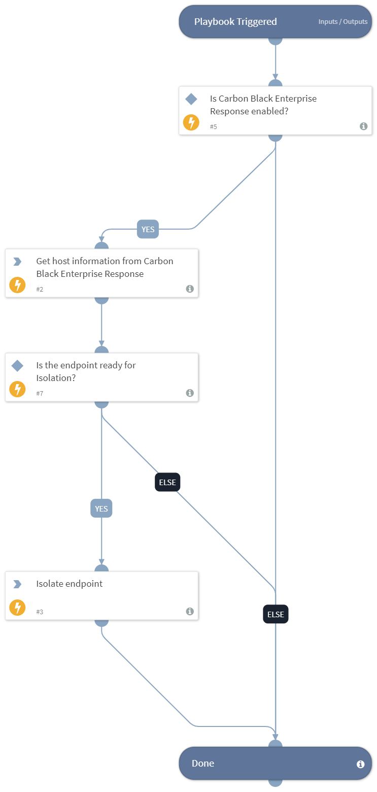

Deprecated. Use the `Block Endpoint - Carbon Black Response V2.1` playbook instead. Carbon Black Response - isolates an endpoint for a given hostname.

## Dependencies

This playbook uses the following sub-playbooks, integrations, and scripts.

### Sub-playbooks

This playbook does not use any sub-playbooks.

### Integrations

CarbonblackV2

### Scripts

IsIntegrationAvailable

### Commands

* cb-quarantine-device
* cb-sensor-info

## Playbook Inputs

---

| **Name** | **Description** | **Default Value** | **Required** |
| --- | --- | --- | --- |
| Hostname | The hostname to isolate. |  | Optional |
| Sensor_id | The sensor ID of the endpoint. |  | Optional |

## Playbook Outputs

---

| **Path** | **Description** | **Type** |
| --- | --- | --- |
| CbResponse.Sensors.CbSensorID | Carbon Black Response sensor IDs that are isolated. | unknown |
| Endpoint | The isolated endpoint. | unknown |
| CbResponse.Sensors.Status | Sensor status. | unknown |
| CbResponse.Sensors.Isolated | Is sensor isolated. | unknown |
| Endpoint.Hostname | Endpoint hostname. | unknown |

## Playbook Image

---

