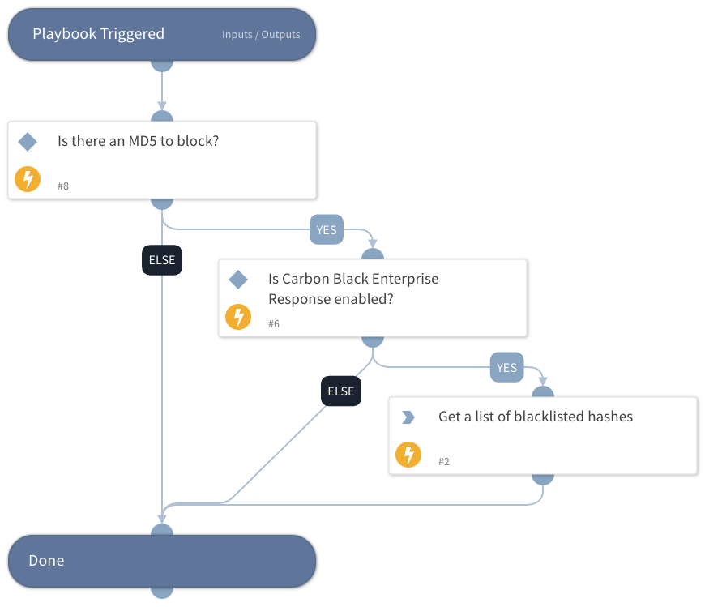

This playbook receives an MD5 hash and adds it to the block list in Carbon Black Enterprise Response. Files with that MD5 hash are blocked from execution on the managed endpoints. If the hash is already on the block list, no action is taken on the MD5.

The playbook uses the integration ''VMware Carbon Black EDR v2".

## Dependencies

This playbook uses the following sub-playbooks, integrations, and scripts.

### Sub-playbooks

This playbook does not use any sub-playbooks.

### Integrations

* CarbonBlackResponseV2

### Scripts

This playbook does not use any scripts.

### Commands

* cb-edr-binary-ban

## Playbook Inputs

---

| **Name** | **Description** | **Default Value** | **Required** |
| --- | --- | --- | --- |
| MD5 | The MD5 hash of the file you want to block. | File.MD5 | Optional |
| Text | Text description of block list. | Blocked by XSOAR | Optional |

## Playbook Outputs

---

| **Path** | **Description** | **Type** |
| --- | --- | --- |
| CbResponse.BlockedHashes.LastBlock.Time | Last block time. | unknown |
| CbResponse.BlockedHashes.LastBlock.Hostname | Last block hostname. | unknown |
| CbResponse.BlockedHashes.LastBlock.CbSensorID | Last block sensor ID. | unknown |

## Playbook Image

---

