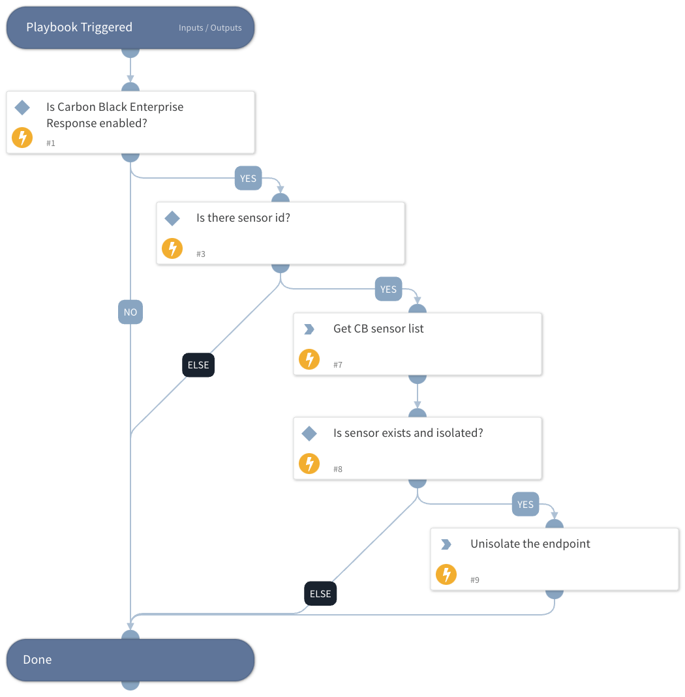

This playbook unisolates sensors according to the sensor ID that is provided in the playbook input.

## Dependencies
This playbook uses the following sub-playbooks, integrations, and scripts.

### Sub-playbooks
This playbook does not use any sub-playbooks.

### Integrations
* carbonblack-v2

### Scripts
* IsIntegrationAvailable

### Commands
* cb-sensor-info
* cb-list-sensors
* cb-unquarantine-device

## Playbook Inputs
---

| **Name** | **Description** | **Default Value** | **Required** |
| --- | --- | --- | --- |
| Endpoint_ID | The sensor id you want to unisolate.  |  | Optional |

## Playbook Outputs
---
There are no outputs for this playbook.

## Playbook Image
---

