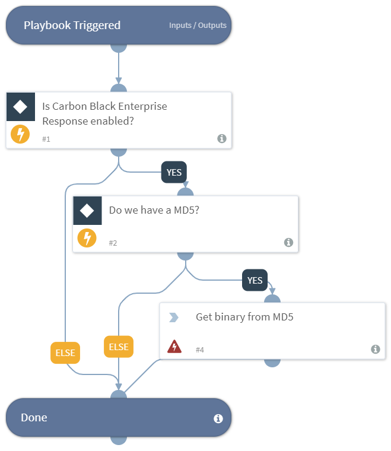

Returns to the War Room, a file sample correlating to MD5 hashes in the input using Carbon Black Enterprise Response integration.

## Dependencies
This playbook uses the following sub-playbooks, integrations, and scripts.

### Sub-playbooks
This playbook does not use any sub-playbooks.

### Integrations
* carbonblack

### Scripts
* Exists

### Commands
* cb-binary-get

## Playbook Inputs
---

| **Name** | **Description** | **Default Value** | **Source** | **Required** |
| --- | --- | --- | --- | --- |
| MD5 | Returns the file sample from the input MD5 hash. | MD5 | File | Optional |

## Playbook Outputs
---

| **Path** | **Description** | **Type** |
| --- | --- | --- |
| File | The file sample. | unknown |

## Playbook Image
---

