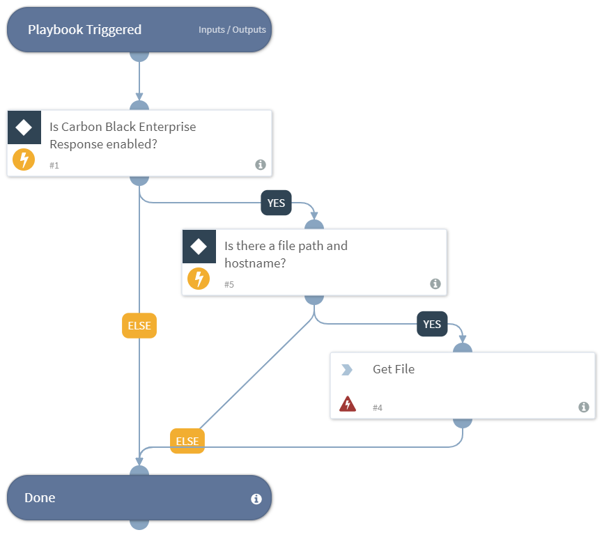

Returns a file sample, to the War Room from a path on an endpoint using Carbon Black Enterprise Response.

## Dependencies
This playbook uses the following sub-playbooks, integrations, and scripts.

### Sub-playbooks
This playbook does not use any sub-playbooks.

### Integrations
This playbook does not use any integrations.

### Scripts
* CBLiveGetFile
* Exists

### Commands
This playbook does not use any commands.

## Playbook Inputs
---

| **Name** | **Description** | **Default Value** | **Required** |
| --- | --- | --- | --- | 
| Hostname | The host to get the file from. | ${Endpoint.Hostname} |Optional |
| Path | The Endpoint path of the file. | ${File.Path} | Optional |

## Playbook Outputs
---

| **Path** | **Description** | **Type** |
| --- | --- | --- |
| File | The file to sample. | unknown |

## Playbook Image
---

