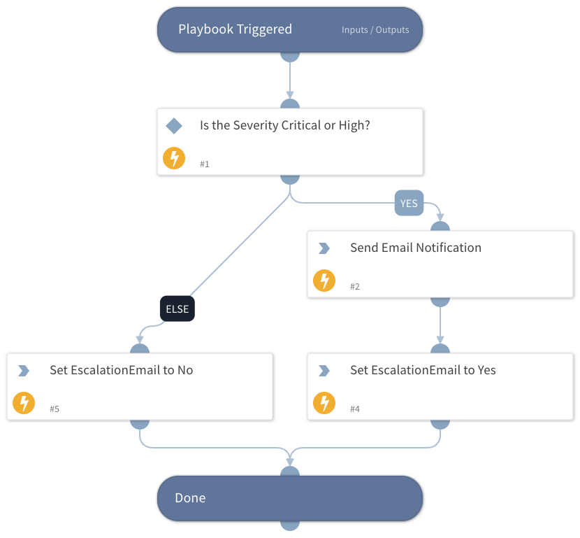

This playbook can be used to send email notification if an Incidents severity is Critical or High.  

Can be used as a sub-playbook to perform the same logic across different playbooks/use cases.

## Dependencies

This playbook uses the following sub-playbooks, integrations, and scripts.

### Sub-playbooks

This playbook does not use any sub-playbooks.

### Integrations

This playbook does not use any integrations.

### Scripts

* Set

### Commands

* send-mail

## Playbook Inputs

---

| **Name** | **Description** | **Default Value** | **Required** |
| --- | --- | --- | --- |
| emails | The email addresses to send the message to, can be comma separated.  |  | Required |
| minimum_severity | The minimum severity level for the Incident to send notification for.  Default is 3 \(High\).   XSOAR Severity values: Critical \(4\), High \(3\), Medium \(2\), Low \(1\), Information \(0.5\), Unknown \(0\) | 3 | Optional |

## Playbook Outputs

---

| **Path** | **Description** | **Type** |
| --- | --- | --- |
| EscalationEmailSent | Whether an escalation email was sent, will be Yes or No | string |

## Playbook Image

---

