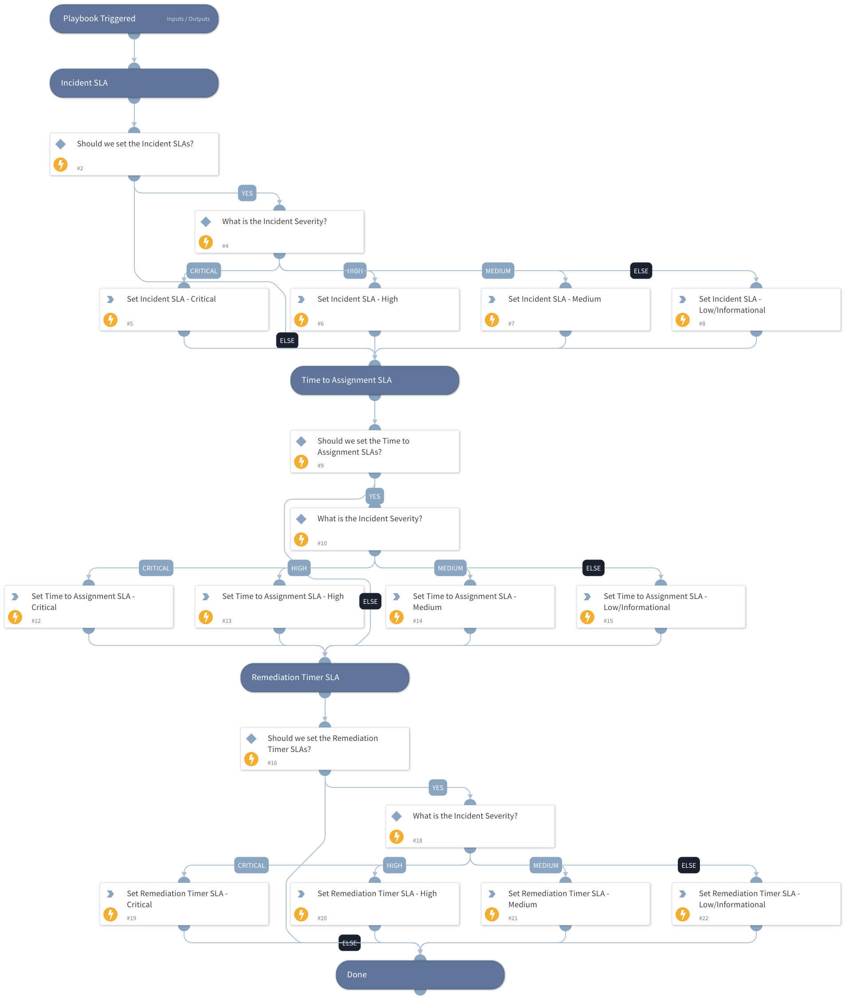

Sets the SLAs for Incidents, the Time to Assignment Timer, and the Remediation SLA Timer based on the Incident Severity.

## Dependencies

This playbook uses the following sub-playbooks, integrations, and scripts.

### Sub-playbooks

This playbook does not use any sub-playbooks.

### Integrations

This playbook does not use any integrations.

### Scripts

This playbook does not use any scripts.

### Commands

* setIncident

## Playbook Inputs

---

| **Name** | **Description** | **Default Value** | **Required** |
| --- | --- | --- | --- |
| SetIncidentSLAs | Set to "True" to set the SLA on the Incident. | True | Optional |
| SetTimeToAssignmentSLAs | Set to "True" to set the SLAs on the Time to Assignment Timer. | True | Optional |
| SetRemediationTimerSLA | Set to "True" to set the SLAs on the Remediation SLA Timer. | True | Optional |
| Severity | The Severity of the Incident. | incident.severity | Optional |
| CriticalRemediationSLA | Number in minutes for the Incident and Remediation Timer SLAs, when the severity of the Incident is Critical. |  | Optional |
| HighRemediationSLA | Number in minutes for the Incident and Remediation Timer SLAs, when the severity of the Incident is High. |  | Optional |
| MediumRemediationSLA | Number in minutes for the Incident and Remediation Timer SLAs, when the severity of the Incident is Medium. |  | Optional |
| LowRemediationSLA | Number in minutes for the Incident and Remediation Timer SLAs, when the severity of the Incident is Low or Informational. |  | Optional |
| CriticalTimeToAssignSLA | Number in minutes for the Time to Assignment Timer SLA, when the severity of the Incident is Critical.  |  | Optional |
| HighTimeToAssignSLA | Number in minutes for the Time to Assignment Timer SLA, when the severity of the Incident is High.  |  | Optional |
| MediumTimeToAssignSLA | Number in minutes for the Time to Assignment Timer SLA, when the severity of the Incident is Medium.  |  | Optional |
| LowTimeToAssignSLA | Number in minutes for the Time to Assignment Timer SLA, when the severity of the Incident is Low or Informational.  |  | Optional |

## Playbook Outputs

---
There are no outputs for this playbook.

## Playbook Image

---

