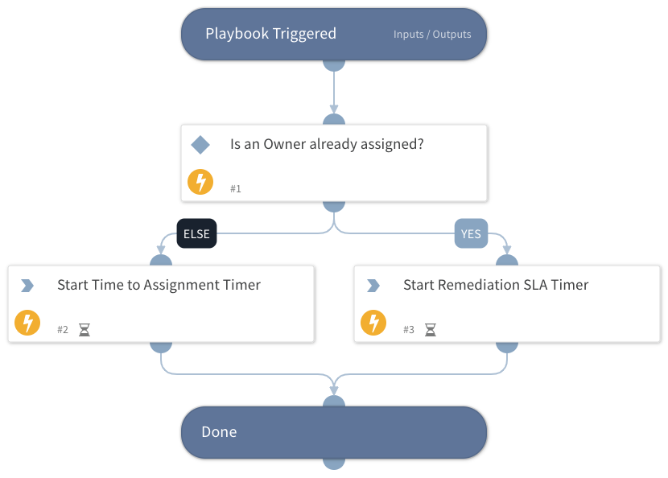

This playbook will start the Time to Assignment or Remediation SLA timers based on whether an Owner is assigned to the Incident.

Can be used as a sub-playbook to perform the same logic across different playbooks/use cases.

## Dependencies

This playbook uses the following sub-playbooks, integrations, and scripts.

### Sub-playbooks

This playbook does not use any sub-playbooks.

### Integrations

This playbook does not use any integrations.

### Scripts

* Print

### Commands

This playbook does not use any commands.

## Playbook Inputs

---
There are no inputs for this playbook.

## Playbook Outputs

---
There are no outputs for this playbook.

## Playbook Image

---

