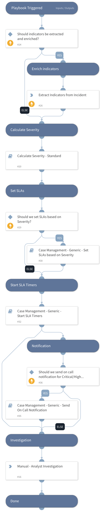

This playbook will extract and enrich indicators upon trigger, calculate Severity, and set SLAs and Timers. 

Can be used as a default playbook to ingest new Incidents, or for manually created Incidents. 

## Dependencies

This playbook uses the following sub-playbooks, integrations, and scripts.

### Sub-playbooks

* Case Management - Generic - Set SLAs based on Severity
* Case Management - Generic - Start SLA Timers
* Calculate Severity - Standard
* Case Management - Generic - Send On Call Notification

### Integrations

This playbook does not use any integrations.

### Scripts

This playbook does not use any scripts.

### Commands

* extractIndicators

## Playbook Inputs

---

| **Name** | **Description** | **Default Value** | **Required** |
| --- | --- | --- | --- |
| Enrich | Determines whether to extract and enrich all indicators in the Incident.  This is run on all Incident fields.  Set to "True" to enable extraction and enrichment. | True | Optional |
| SetSLAs | Set to "True" to enable setting SLAs for the Incident, Time to Assignment, and Remediation SLA Timers.    Complete the other inputs to set the SLA, and Timer SLAs based on Severity. | False | Optional |
| SetIncidentSLAs | Set to "True" to set the SLA on the Incident. | False | Optional |
| SetTimeToAssignmentSLAs | Set to "True" to set the SLAs on the Time to Assignment Timer. | False | Optional |
| SetRemediationTimerSLA | Set to "True" to set the SLAs on the Remediation SLA Timer. | False | Optional |
| CriticalRemediationSLA | Number in minutes for the Incident and Remediation Timer SLAs, when the severity of the Incident is Critical. | 180 | Optional |
| HighRemediationSLA | Number in minutes for the Incident and Remediation Timer SLAs, when the severity of the Incident is High. | 300 | Optional |
| MediumRemediationSLA | Number in minutes for the Incident and Remediation Timer SLAs, when the severity of the Incident is Medium. | 1440 | Optional |
| LowRemediationSLA | Number in minutes for the Incident and Remediation Timer SLAs, when the severity of the Incident is Low or Informational. | 7200 | Optional |
| CriticalTimeToAssignSLA | Number in minutes for the Time to Assignment Timer SLA, when the severity of the Incident is Critical.  | 15 | Optional |
| HighTimeToAssignSLA | Number in minutes for the Time to Assignment Timer SLA, when the severity of the Incident is High.  | 60 | Optional |
| MediumTimeToAssignSLA | Number in minutes for the Time to Assignment Timer SLA, when the severity of the Incident is Medium.  | 180 | Optional |
| LowTimeToAssignSLA | Number in minutes for the Time to Assignment Timer SLA, when the severity of the Incident is Low or Informational.  | 1440 | Optional |
| SendOnCallNotification | Whether to send the on call notification email based on the Incidents Severity.   Set to Yes to send notifications, and add the emails to the NotificationEmails.  | No | Optional |
| NotificationEmails | The email addresses to send the message to, can be comma separated.  |  | Optional |
| MinimumSeverity | The minimum severity level for the Incident to send notification for.  Default is 3 \(High\).   XSOAR Severity values: Critical \(4\), High \(3\), Medium \(2\), Low \(1\), Information \(0.5\), Unknown \(0\) | 3 | Optional |

## Playbook Outputs

---
There are no outputs for this playbook.

## Playbook Image

---

