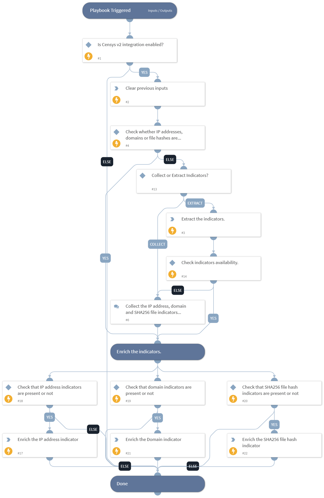

This playbook enriches the IP addresses, domains, and SHA256 file hashes indicators with Censys threat intelligence data.

## Dependencies

This playbook uses the following sub-playbooks, integrations, and scripts.

### Sub-playbooks

This playbook does not use any sub-playbooks.

### Integrations

* CensysV2

### Scripts

* DeleteContext

### Commands

* cen-search
* domain
* findIndicators
* ip

## Playbook Inputs

---

| **Name** | **Description** | **Default Value** | **Required** |
| --- | --- | --- | --- |
| ip_addresses | Specify the IP address\(es\) to enrich. |  | Optional |
| domains | Specify the domain\(s\) to enrich. |  | Optional |
| file_hashes | Specify the SHA256 file hash\(es\) to enrich. |  | Optional |

## Playbook Outputs

---
There are no outputs for this playbook.

## Playbook Image

---

