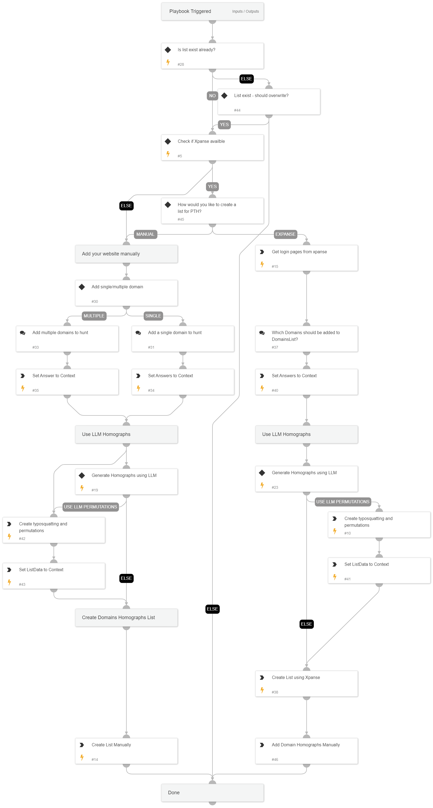

This playbook help analysts creating a new list of domains to monitor using CertStream integration.

## Dependencies

This playbook uses the following sub-playbooks, integrations, and scripts.

### Sub-playbooks

This playbook does not use any sub-playbooks.

### Integrations

This playbook does not use any integrations.

### Scripts

* IsIntegrationAvailable
* SetAndHandleEmpty
* IsListExist

### Commands

* createList
* asm-list-external-websites
* gpt-send-message

## Playbook Inputs

---

| **Name** | **Description** | **Default Value** | **Required** |
| --- | --- | --- | --- |
| ResultsLimit | Number of websites results to return | 100 | Optional |
| AuthenticationType | The authentication type of the returned websites. default is all | Form | Optional |
| LLMHomogrpahEnable | Enable/Disable using LLM \(default to chatGPT\) to generate homographic permutations of the domain to hunt | False | Optional |
| DomainsListName | The name for the list of domain homographs | DomainsList | Optional |

## Playbook Outputs

---
There are no outputs for this playbook.

## Playbook Image

---

