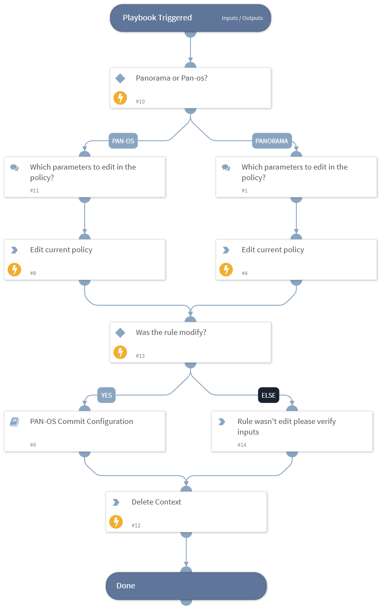

This playbook will guide the user in the process of editing existing policy, the playbook will send a data collection form that will retrieve the relevant parameters for editing the existing rule.

## Dependencies
This playbook uses the following sub-playbooks, integrations, and scripts.

### Sub-playbooks
* PAN-OS Commit Configuration

### Integrations
This playbook does not use any integrations.

### Scripts
* DeleteContext

### Commands
* panorama-edit-rule

## Playbook Inputs
---

| **Name** | **Description** | **Default Value** | **Required** |
| --- | --- | --- | --- |
| SecurityTeamEmail | The email of the relevant security team for FW change management approval. |  | Optional |
| rulename | The name of the relevant policy. |  | Optional |

## Playbook Outputs
---
There are no outputs for this playbook.

## Playbook Image
---
