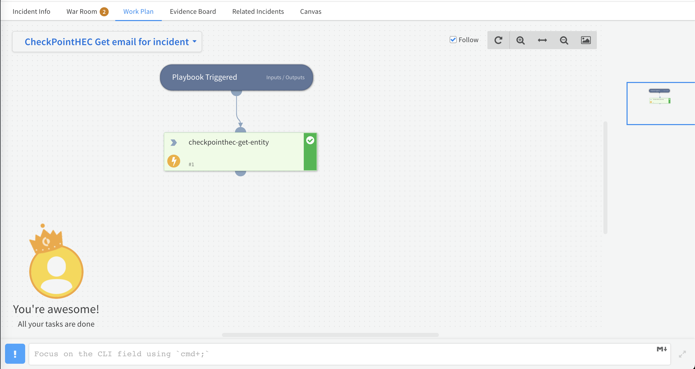

Get email entity for a specific incident

## Dependencies

This playbook uses the following sub-playbooks, integrations, and scripts.

### Sub-playbooks

This playbook does not use any sub-playbooks.

### Integrations

* CheckPointHEC

### Scripts

This playbook does not use any scripts.

### Commands

* checkpointhec-get-entity

## Playbook Inputs

---

| **Name** | **Description** | **Default Value** | **Required** |
| --- | --- | --- | --- |
| entity | Get email entity id from incident | ${incident.checkpointhecentity} | Required |

## Playbook Outputs

---

| **Path** | **Description** | **Type** |
| --- | --- | --- |
| CheckPointHEC.Entity.subject | Email subject | string |

## Playbook Image

---

