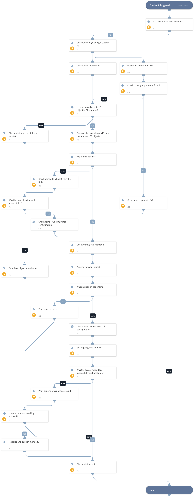

The playbook receives malicious IP addresses as inputs, checks if the object group exists (if not, the object group is created), and  appends the related IPs to that object. If you have not assigned the appended group to a rule in your firewall policy, you can use `rule_name` and the playbook creates a new rule.

## Dependencies
This playbook uses the following sub-playbooks, integrations, and scripts.

### Sub-playbooks
* Checkpoint - Publish&Install configuration

### Integrations
* CheckPointFirewallV2

### Scripts
* isError
* CompareLists
* SetAndHandleEmpty
* Print

### Commands
* checkpoint-group-update
* checkpoint-show-objects
* checkpoint-logout
* checkpoint-host-add
* checkpoint-group-get
* checkpoint-access-rule-add
* checkpoint-login-and-get-session-id
* checkpoint-group-add

## Playbook Inputs
---

| **Name** | **Description** | **Default Value** | **Required** |
| --- | --- | --- | --- |
| IP | An array of malicious IPs to block \(Can be also provided as a context path. e.g. $\{IP\} \). Example:     1.1.1.1,2.2.2.2 |  | Required |
| install_policy | Whether the playbook should continue install policy process for Check Point Firewall. | False | Required |
| policy_package | The name of the policy package to be installed. | Standard | Required |
| block_IP_error_handling | If one of the actions for the Block IP playbook fails due to issues on the Check Point Firewall, this input determines whether the playbook continues or stops for manual review. If the playbook continues, the session ID logs out and all Check Point changes are discarded. Values are "Continue" or "Stop". The default value is "Stop". | Stop | Optional |
| checkpoint_error_handling | If one of the actions for publish/install policy fails due to issues on the Check Point side, this input determines whether the playbook continues or stops for manual review. If the playbook continues, the session ID logs out and all Check Point changes are discarded. Values are "Continue" or "Stop". The default value is "Stop". | Stop | Required |
| group_name | The group name to be appended with the provided IPs.  The group is created if it does not already exist. |  | Required |
| rule_name | Creates a new blocking rule using this Check Point Firewall group. Use this option if you have not assigned the appended group to a rule in your firewall policy. |  | Optional |
| rule_layer | Determines which Check Point Firewall rule layer is used. By default, the "Network" layer is used, but this can be changed. | Network | Optional |
| rule_position | Determines which Check Point Firewall rule position is used. By default, the "top" position is used, but this can be changed. | top | Optional |

## Playbook Outputs
---
There are no outputs for this playbook.

## Playbook Image
---

