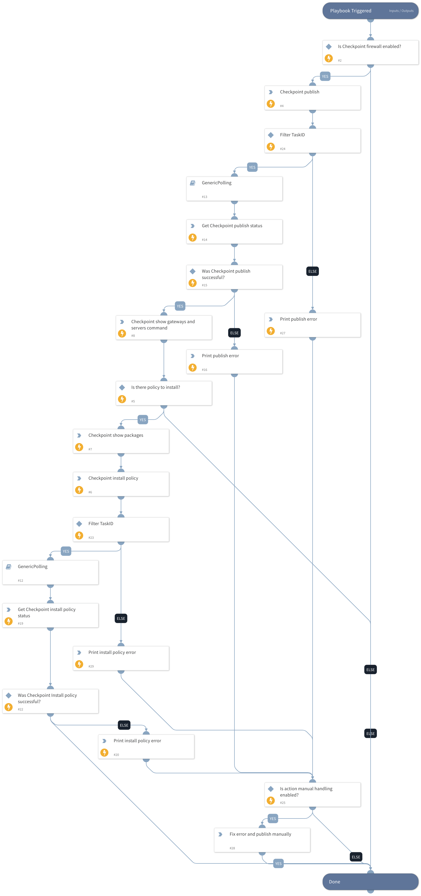

Publish the Check Point Firewall configuration and install policy on all available gateways.

## Dependencies
This playbook uses the following sub-playbooks, integrations, and scripts.

### Sub-playbooks
* GenericPolling

### Integrations
* CheckPointFirewallV2

### Scripts
* PrintErrorEntry

### Commands
* checkpoint-gateways-list
* checkpoint-show-task
* checkpoint-publish
* checkpoint-install-policy
* checkpoint-packages-list

## Playbook Inputs
---

| **Name** | **Description** | **Default Value** | **Required** |
| --- | --- | --- | --- |
| sid | SID - Session unique identifier as returned by the login request required for publish/install changes. Change configuration is seen by all users only after publishing and policy install is complete. |  | Required |
| install_policy | Whether the playbook should continue install policy process for Check Point Firewall. | False | Required |
| policy_package | The name of the policy package to be installed. | Standard | Required |
| action_manual_handling | If one of the actions for the publish/install policy fails due to a problem or error, the playbook will pause for manual review. | True | Required |

## Playbook Outputs
---
There are no outputs for this playbook.

## Playbook Image
---

