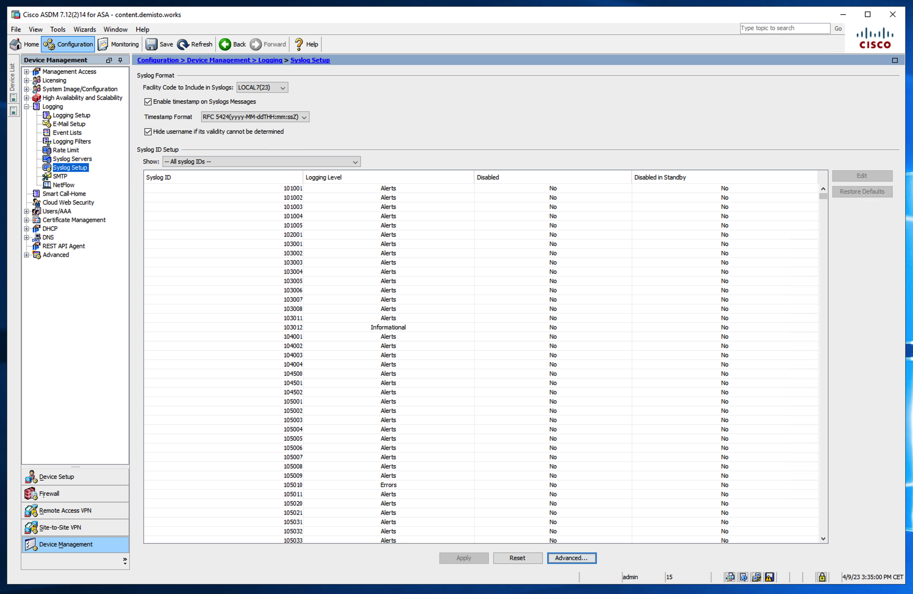

## Collect Events from Vendor

In order to use the collector, use the [Broker VM](#broker-vm) option.

### Broker VM
You will need to use the information described [here](https://docs-cortex.paloaltonetworks.com/r/Cortex-XDR/Cortex-XDR-Pro-Administrator-Guide/Configure-the-Broker-VM).

1. Navigate to **Settings** &rarr; **Configuration** &rarr; **Data Broker** &rarr; **Broker VMs**. 
2. Go to the **APPS** column under the **Brokers** tab and add the **Syslog** app for the relevant broker instance. If the Syslog app already exists, hover over it and click **Configure**.
3. Click **Add New**.
4. When configuring the Syslog Collector, set the following parameters:
   | Parameter     | Value    
   | :---          | :---                    
   | `Vendor`      | Enter **Cisco**. 
   | `Product`     | Enter **ASA**. 

### Configure Timestamp on Cisco ASA
Supported date format is RFC 5424, for example: "2023-04-09T16:30:00Z", "2023-04-09T16:30:00+07:00".

1. Access the Cisco ADSM.
2. Go to Configuration &rarr; logging &rarr; Syslog setup.
3. On Timestamp Format drildown click on the option "RFC 5424(yyyy-MM-ddTHH:mm:ssZ)".
4. Click on the Apply button.

Another supported date format is "Jul 08 09:14:35 UTC".

**Note** : If a different timestamp format is used, time extraction and mapping will not be supported.

### The supported events on Modeling rules:
The following events are supported by modeling rules (220 events):
- 103001,104001,104002,104004,105001,105002,105003,105004,105005,105006,105007,105008,105009,105043,106001,106006,106007,106014,106015,106016,106017,106020,106021,106023,106023,106100,106102,108004,108005,109201,109207,109210,110002,110003,111001,111004,111005,111007,111008,111009,111010,113003,113004,113005,113008,113009,113010,113011,113012,113013,113014,113015,113019,113022,113023,113039,120003,120005,120006,120007
- 209005,209006,201010,210022,212004,212010,216004
- 302004,302010,302012,302013,302014,302015,302016,302020,302021,303002,305009,305011,305011,305012,308001,313001,313004,313005,313008,313009,315011,317077,317078,318039,323006,336010,336013
- 401004,402117,402123,405001,405003,405104,409023,410001,411001,411002,411004,418001,419002,426001,426002,434002,434004,434004,444303,444305,444306
- 500003,500004,502101,502102,502103,503001,505011,506001,507003
- 602101,605004,605005,606001,606002,606003,606004,607001,609002,611101,611102,611103,611104
- 709003,709004,709006,709008,710003,710005,711004,713048,713081,713105,713255,716001,716002,716038,716039,716058,716059,717007,717022,717028,717037,717054,717055,717056,717058,720010,720024,720025,720027,720028,720029,720032,720037,720039,720040,720046,720062,720063,721002,721003,722003,722010,722011,722012,722022,722023,722028,722032,722033,722034,722035,722036,722037,722041,722051,722055,725001,725002,725003,725006,725007,725016,733100,734001,735013,735014,737005,737013,737015,737017,737034,737036,737037,746016,768004,769005,769007,771002,772004
- 812007