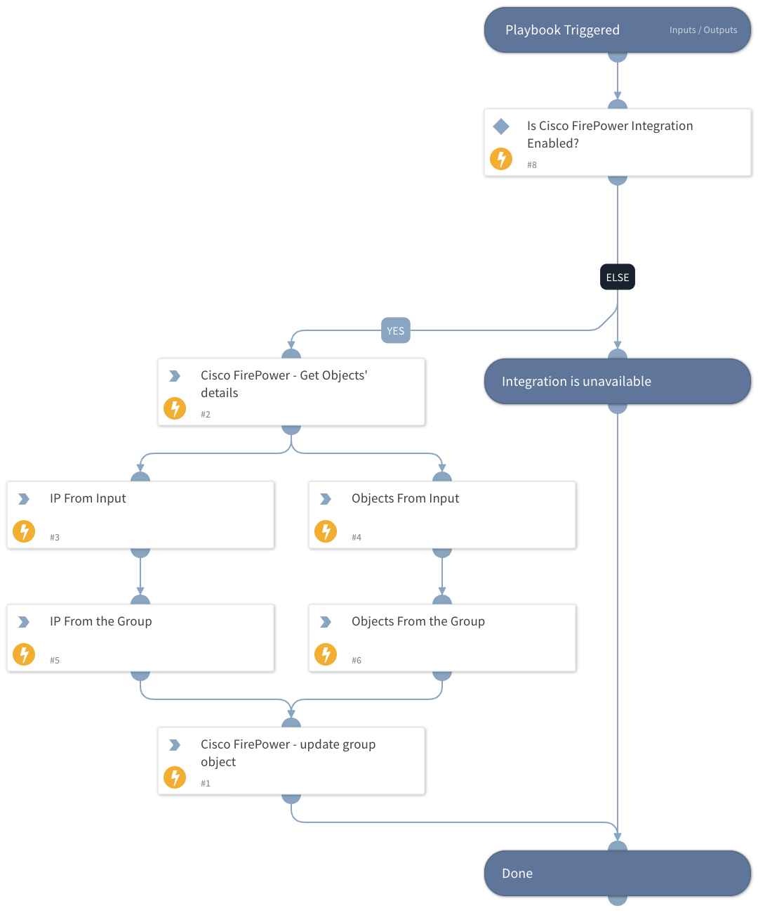

This playbook will append a network group object with new elements (IPs or network objects).

## Dependencies
This playbook uses the following sub-playbooks, integrations, and scripts.

### Sub-playbooks
This playbook does not use any sub-playbooks.

### Integrations
Cisco Firepower

### Scripts
SetAndHandleEmpty

### Commands
* ciscofp-get-network-groups-object
* ciscofp-update-network-groups-objects

## Playbook Inputs
---

| **Name** | **Description** | **Default Value** | **Required** |
| --- | --- | --- | --- |
| ID | The ID of the network group object to append. This information can be retrieved using -   \!ciscofp-get-network-groups-object |  | Required |
| Name | The name of the network group. |  | Required |
| Override | Possible Value: True / False  | False | Optional |
| IP | Enter a comma-separated list of IPs that will be added to the list. |  | Optional |
| ObjectID | You may add a group of IPs by using the Object ID. You can use \!ciscofp-get-network-object for more details.  For example, if you have certain server internal ranges unified in a networking group, you can add them to a larger group (such as internal address whose ID was supplied in the "ID" field). |  | Optional |

## Playbook Outputs
---
There are no outputs for this playbook.

## Playbook Image
---

