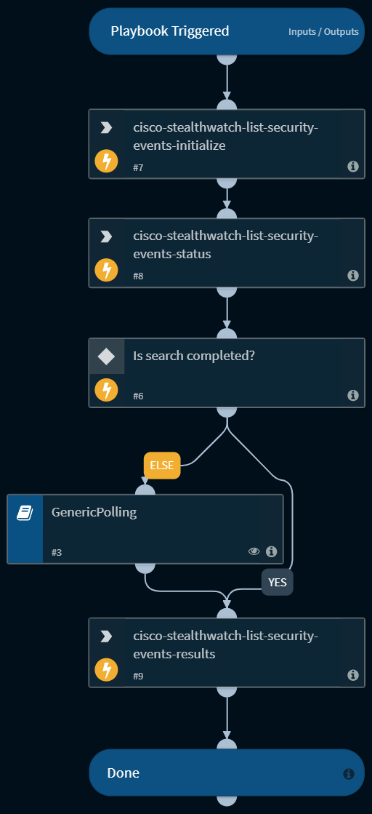

This playbook lists security events and returns the results to the context.

## Dependencies
This playbook uses the following sub-playbooks, integrations, and scripts.

### Sub-playbooks
* GenericPolling

### Integrations
* Cisco Stealthwatch

### Scripts
This playbook does not use any scripts.

### Commands
* cisco-stealthwatch-list-security-events-results
* cisco-stealthwatch-list-security-events-status
* cisco-stealthwatch-list-security-events-initialize

## Playbook Inputs
---

| **Name** | **Description** | **Default Value** | **Required** |
| --- | --- | --- | --- |
| timeout | The amount of time to wait before a timeout occurs \(in minutes\). | 600 | Optional |
| interval | Polling frequency - how often the polling command should run \(in minutes\). | 1 | Optional |
| range | Range of results to return \(e.g., 0-20\). | 0-20 | Optional |
| tenant_id | Tenant ID represents the domain on Cisco Stealthwatch. | 102 | Required |
| time_range |  | 1 month ago | Required |

## Playbook Outputs
---

| **Path** | **Description** | **Type** |
| --- | --- | --- |
| CiscoStealthwatch.SecurityEventResults | The results of the search. | unknown |

## Playbook Image
