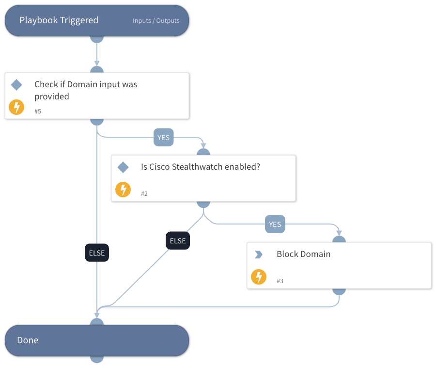

This playbook blocks domains using Cisco Stealthwatch Cloud.

## Dependencies

This playbook uses the following sub-playbooks, integrations, and scripts.

### Sub-playbooks

This playbook does not use any sub-playbooks.

### Integrations

* Stealthwatch Cloud

### Scripts

This playbook does not use any scripts.

### Commands

* sw-block-domain-or-ip

## Playbook Inputs

---

| **Name** | **Description** | **Default Value** | **Required** |
| --- | --- | --- | --- |
| Domain | The domain to block. |  | Optional |

## Playbook Outputs

---
There are no outputs for this playbook.

## Playbook Image

---

