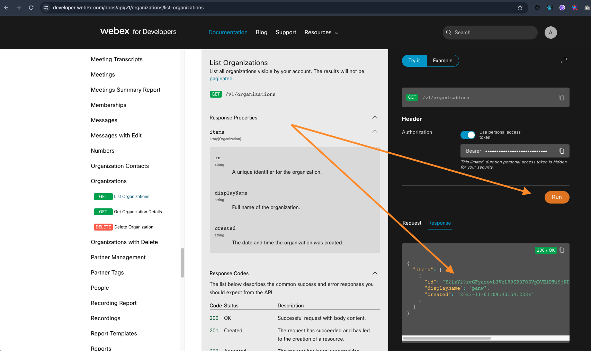

## Cisco Webex Event Collector Help

### Cisco Webex Event Collector collects three types of events.
* Admin Audit Events.
* Security Audit Events (user sign-in and sign-out data).
* Events.

### There are two application clients to set up.
[Click here to create a new client](https://developer.webex.com/my-apps)
* Admin client (for `Admin Audit Events` and `Security Audit Events`).
* Compliance Officer client (for `Events`).

### Each client needs three parameters:
* client ID.
* client secret.
* client redirect URI.

_Note the Admin client needs a fourth parameter: `organization ID`._\
Run [this](https://developer.webex.com/docs/api/v1/organizations/list-organizations) HTTP request (login with admin credentials) to get the organization ID.

