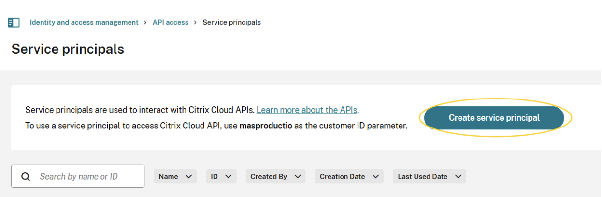
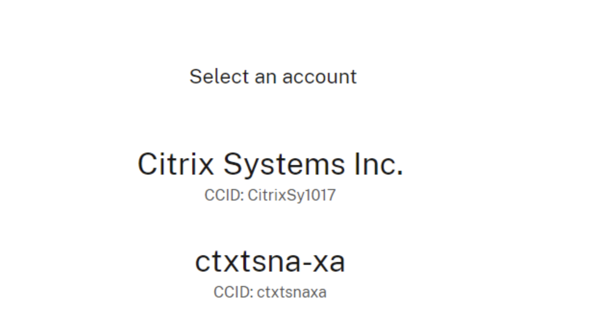

This is the default integration for this content pack when configured by the Data Onboarder in Cortex XSIAM.

## Configure Citrix Daas Event Collector in Cortex

| **Parameter** | **Description** | **Required** |
| --- | --- | --- |
| Server URL |  | True |
| Client Id |  | True |
| Client Secret |  | True |
| Customer ID |  | True |
| Max events per fetch | The maximum amount of events to retrieve. This requires the configuration logging database to be configured and enabled. Results are returned in the order of most-recent to least-recent.| False |
| Trust any certificate (not secure) |  | False |
| Use system proxy settings |  | False |

## Step by step configuration

### Prerequisites

**Get Access to Citrix Cloud**

Sign up for a free Citrix Cloud account, or log in to Citrix Cloud.

Citrix Cloud API Access with Service Principals
A service principal acts as an API client to Citrix Cloud APIs and has the following characteristics:

**1. Create a Service Principal**

In the Citrix Cloud console, click the menu in the upper left corner.

**2. Select Identity and Access Management > API Access > Service principals > Create service principal and follow the steps to completion.**

If these options do not appear, you might not have sufficient permissions to manage service principals. Contact your administrator to get the required full access permission.

**3. Add the credentials to your secret management tool as the secret will only appear once**

**4. Customer ID is a mandatory parameter that must be passed in the Citrix-CustomerId header. To get the customer ID:**

1. Log in to the [Citrix Cloud](https://onboarding.cloud.com).
2. Select the Identity and Access Management option from the menu.
3. Click the API Access tab. You can see the customer ID in the description above the Create Client button.

### Steps to identify your tenant's Citrix Cloud ID

1. Log in to https://citrix.cloud.com
2. If you have access to more than one tenant, their names and Citrix Cloud IDs will be presented to you in a list format for you to select which one you want to sign in to.  Example below:

3. Once you sign in, the Tenant's Citrix Cloud ID is also presented in the top right corner of the screen as shown in an example here (ctxtsnaxa)

## Commands

You can execute these commands from the CLI, as part of an automation, or in a playbook.
After you successfully execute a command, a DBot message appears in the War Room with the command details.

### citrix-daas-get-events

***
Returns system log events extracted from Citrix.

#### Base Command

`citrix-daas-get-events`

#### Input

| **Argument Name** | **Description** | **Required** |
| --- | --- | --- |
| should_push_events | Set this argument to True in order to create events, otherwise the command will only display the events. Possible values are: true, false. Default is false. | Required |
| limit | The maximum number of logs to return. Default is 10. | Optional |
| search_date_option | Specific time filters for searching operations. | Optional |

#### Context Output

There is no context output for this command.
