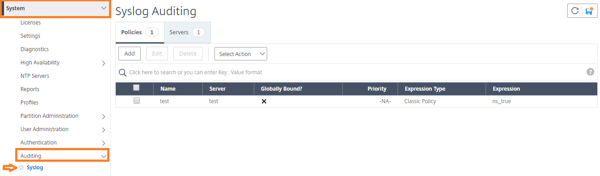
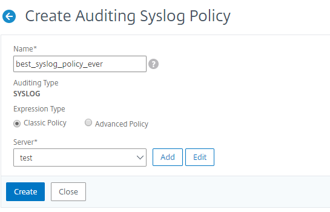

# Citrix ADC
This pack includes Cortex XSIAM content. 

## Configuration on Server Side
You need to configure an audit log policy in the Citrix ADC UI.

1. Navigate to **Configuration** > **System** > **Auditing** > **Syslog**.

2. Select **Servers** tab.
3. Click **Add**.
4. In the **Create Auditing Server** page, populate the relevant fields, and click **Create**.
5. To add the policy, select the **Policies** tab, and click **Add**.
6. In the **Create Auditing Syslog Policy** page, populate the relevant fields, and click **Create**.

7. To bind the policy globally, select **Advanced Policy Global Bindings** from the dropdown list. Select the **best_syslog_policy_ever** policy. Click **Select**.
8. From the dropdown list, select the bind point as **SYSTEM_GLOBAL** and click **Bind**, and then click **Done**.
9. Navigate to **System** > **Auditing** > **Message Actions**, and create the audit message action.

Note:
In order to parse the timestamp correctly, make sure to configure the logs to be sent in a GMT timezone.

## Collect Events from Vendor

In order to use the collector, use the [Broker VM](#broker-vm) option.

### Broker VM
To create or configure the Broker VM, use the information described [here](https://docs-cortex.paloaltonetworks.com/r/Cortex-XDR/Cortex-XDR-Pro-Administrator-Guide/Configure-the-Broker-VM).

You can configure the specific vendor and product for this instance.

1. Navigate to **Settings** > **Configuration** > **Data Broker** > **Broker VMs**. 
2. Right-click, and select **Syslog Collector** > **Configure**.
3. When configuring the Syslog Collector, set the following values:
   - vendor as vendor - citrix
   - product as product - adc
