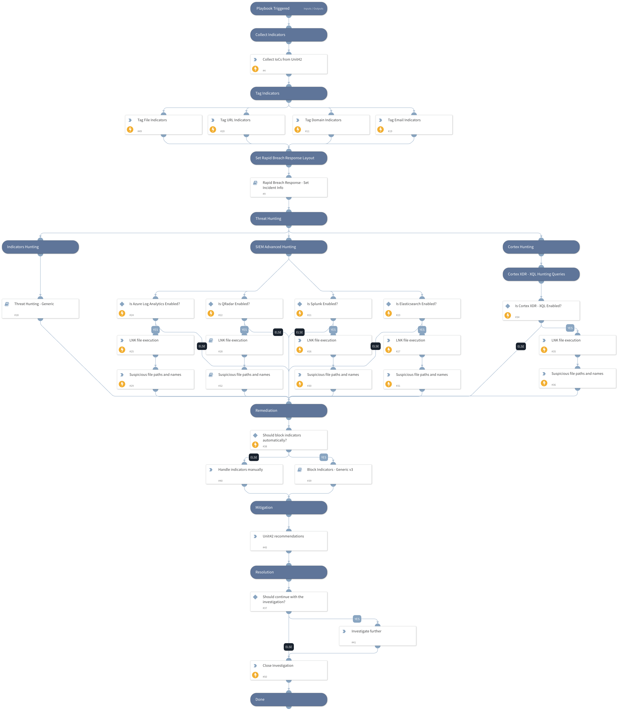

## Cloaked Ursa: Targeting Diplomatic Missions with Phishing Lures

**Summary:**

Cloaked Ursa, a hacking group associated with Russia's Foreign Intelligence Service, has been persistently targeting diplomatic missions globally. Using phishing tactics, Their initial access attempts over the past two years have predominantly used phishing lures with a theme of diplomatic operations such as the following:

- Notes verbale (semiformal government-to-government diplomatic communications)
- Embassies’ operating status updates
- Schedules for diplomats
- Invitations to embassy events

 Recently, Unit42 researchers observed a shift in their strategy, with a focus on targeting diplomats themselves. In Kyiv alone, at least 22 out of over 80 foreign missions were targeted.

**This playbook should be triggered manually or can be configured as a job.** 

Please create a new incident and choose the Cloaked Ursa (APT29) Diplomatic Phishing Campaign playbook and Rapid Breach Response incident type.

**The playbook includes the following tasks:**

**IoCs Collection**
- Blog IoCs download

**Hunting:**
- Cortex XDR XQL exploitation patterns hunting
- Advanced SIEM exploitation patterns hunting
- Indicators hunting

The hunting queries are searching for the following activities:
  - Related LNK files execution command line
  - Dropped file names

**Mitigations:**
- Unit42 mitigation measures

**References:**

[Diplomats Beware: Cloaked Ursa Phishing With a Twist](https://unit42.paloaltonetworks.com/cloaked-ursa-phishing/)

## Dependencies

This playbook uses the following sub-playbooks, integrations, and scripts.

### Sub-playbooks

* QRadarFullSearch
* Block Indicators - Generic v3
* Threat Hunting - Generic
* Rapid Breach Response - Set Incident Info

### Integrations

This playbook does not use any integrations.

### Scripts

* CreateNewIndicatorsOnly
* ParseHTMLIndicators

### Commands

* es-eql-search
* azure-log-analytics-execute-query
* splunk-search
* closeInvestigation
* xdr-xql-generic-query

## Playbook Inputs

---

| **Name** | **Description** | **Default Value** | **Required** |
| --- | --- | --- | --- |
| PlaybookDescription | The playbook description to be used in the Rapid Breach Response - Set Incident Info sub-playbook. | ## Cloaked Ursa: Targeting Diplomatic Missions with Phishing Lures  **Summary:**  Cloaked Ursa, a hacking group associated with Russia's Foreign Intelligence Service, has gained notoriety for its persistent targeting of diplomatic missions globally. Using phishing tactics, Their initial access attempts over the past two years have predominantly used phishing lures with a theme of diplomatic operations such as the following:  - Notes verbale (semiformal government-to-government diplomatic communications) - Embassies’ operating status updates - Schedules for diplomats - Invitations to embassy events   Recently, Unit42 researchers observed a shift in their strategy, with a focus on targeting diplomats themselves. In Kyiv alone, at least 22 out of over 80 foreign missions were targeted.  **This playbook should be triggered manually or can be configured as a job.**   Please create a new incident and choose the Cloaked Ursa (APT29) Diplomatic Phishing Campaign playbook and Rapid Breach Response incident type.  **The playbook includes the following tasks:**  **IoCs Collection** - Blog IoCs download  **Hunting:** - Cortex XDR XQL exploitation patterns hunting - Advanced SIEM exploitation patterns hunting - Indicators hunting  The hunting queries are searching for the following activities:   - Related LNK files execution command line   - Dropped file names  **Mitigations:** - Unit42 mitigation measures  **References:**  [Diplomats Beware: Cloaked Ursa Phishing With a Twist](https://unit42.paloaltonetworks.com/cloaked-ursa-phishing/)  | Optional |
| autoBlockIndicators | Wether to block the indicators automatically. | True | Optional |
| QRadarTimeRange | The time range for the QRadar queries. | Last 30 Days | Optional |
| SplunkEarliestTime | The time range for the Splunk queries. | -30d@d | Optional |
| ElasticEarliestTime | The time range for the Elastic queries. | now-30d/d | Optional |
| LogAnalyticsTimespan | The time range for the Azure Log Analytics queries. | 30d | Optional |
| XQLTimeRange | The time range for the XQL queries. | 30 days ago | Optional |
| ElasticIndex | The elastic index to search in. |  | Optional |
| emailIndicators | The email indicators provided in the blog. | dawid.tomaszewski@resetlocations.com, ops.rejon4@kazmierz.pl | Optional |

## Playbook Outputs

---
There are no outputs for this playbook.

## Playbook Image

---

