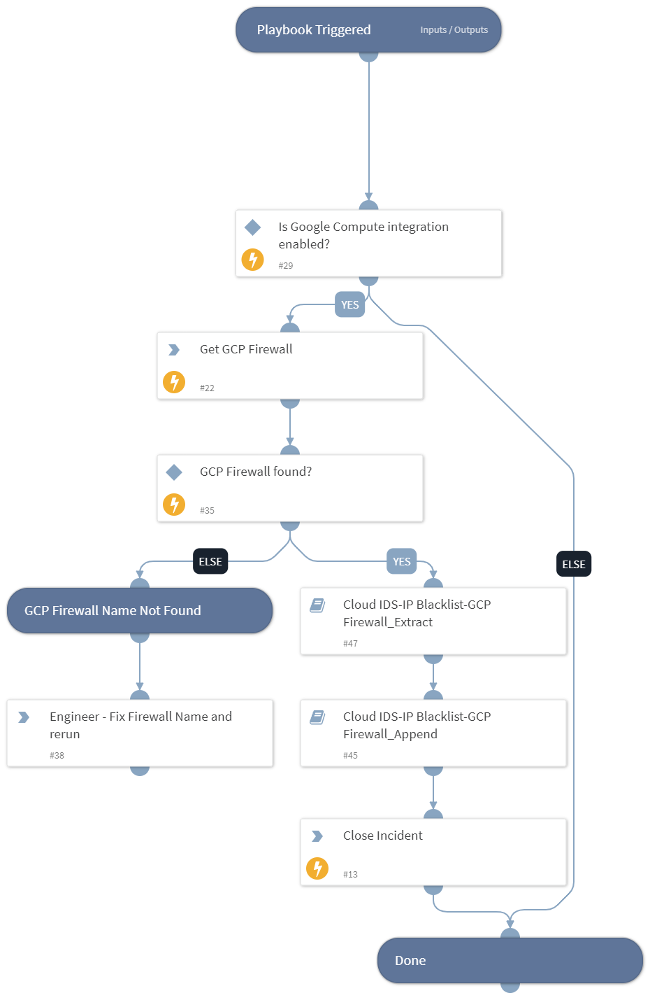
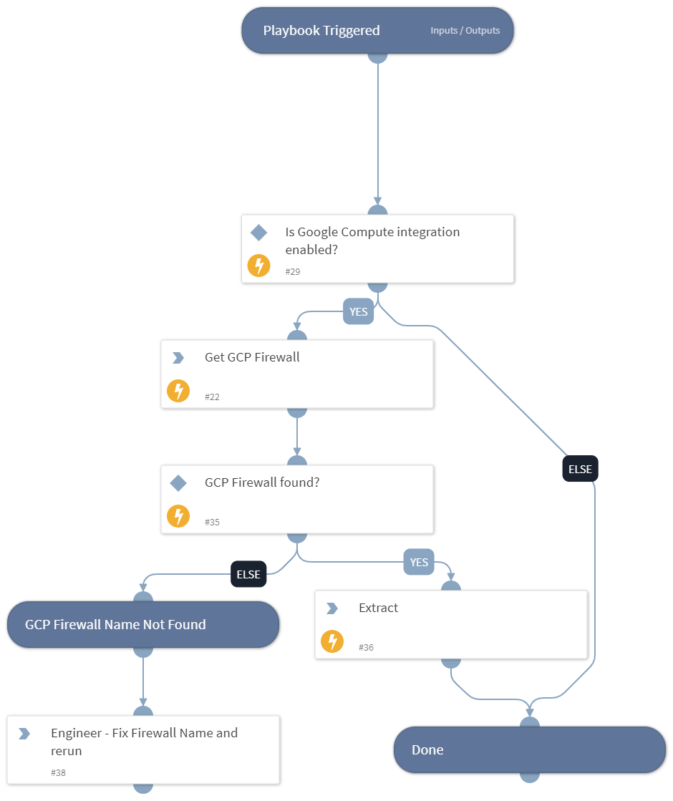
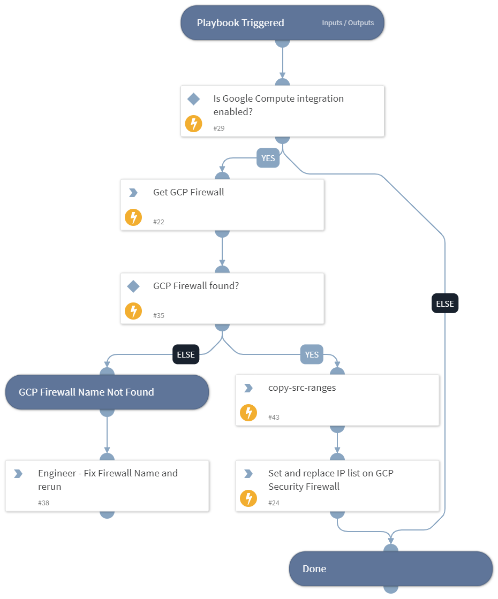

# CloudIDS
Google Cloud IDS is a next-generation advanced intrusion detection service that provides threat detection for intrusions, malware, spyware, and command-and-control attacks.

## What does this pack do?

### Playbook
* `Cloud_IDS-IP_Blacklist-GCP_Firewall_Extract`: Gets the attacker's IP address from Cloud IDS through Google Pub/Sub. 
  `Cloud_IDS-IP_Blacklist-GCP_Firewall_Append` will update the ip list to patch GCP firewall.
  
#### Flow Chart of Playbook 
* [Cloud_IDS-IP_Blacklist-GCP_Firewall](Playbooks/Cloud_IDS-IP_Blacklist-GCP_Firewall_README.md)

## Dependencies
### Packs
* [GoogleCloudCompute](../GoogleCloudCompute).

