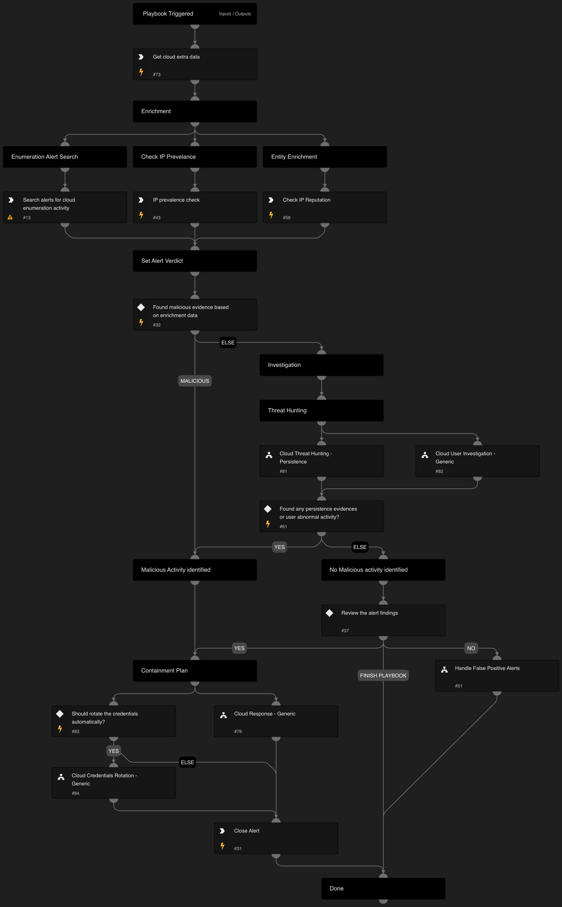

## Cloud Data Exfiltration Response

The Cloud Data Exfiltration Response playbook is designed to address data exfiltration activity alerts in the cloud environment. This playbook is intended for handling "An identity performed a suspicious download of multiple cloud storage object" alert.
The playbook supports AWS, GCP, and Azure and executes the following:
- Enrichment involved assets. 
- Determines the appropriate verdict based on the data collected from the enrichment. 
- Cloud Persistence Threat Hunting:
  - Conducts threat hunting activities to identify any cloud persistence techniques
- Verdict Handling:
  - Handles false positives identified during the investigation
  - Handles true positives by initiating appropriate response actions

## Dependencies

This playbook uses the following sub-playbooks, integrations, and scripts.

### Sub-playbooks

* Cloud User Investigation - Generic
* Handle False Positive Alerts
* Cloud Threat Hunting - Persistence
* Cloud Response - Generic

### Scripts

SearchAlertsV2

### Commands

* core-get-cloud-original-alerts
* closeInvestigation
* core-get-IP-analytics-prevalence
* ip

## Playbook Inputs

---

| **Name** | **Description** | **Default Value** | **Required** |
| --- | --- | --- | --- |
| Auto containmnet | Whether to execute containment automatically. This action allows you to respond rapidly but has a higher probability for a False Positive. | False | Optional |

## Playbook Image

---

