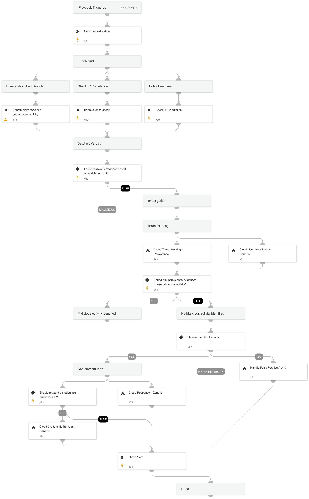

## Cloud Data Exfiltration Response

The Cloud Data Exfiltration Response playbook is designed to address data exfiltration activity alerts in the cloud environment. This playbook is intended for handling "An identity performed a suspicious download of multiple cloud storage object" alert.
The playbook supports AWS, GCP, and Azure and executes the following:
- Enrichment involved assets. 
- Determines the appropriate verdict based on the data collected from the enrichment. 
- Cloud Persistence Threat Hunting:
  - Conducts threat hunting activities to identify any cloud persistence techniques
- Verdict Handling:
  - Handles false positives identified during the investigation
  - Handles true positives by initiating appropriate response actions

## Dependencies

This playbook uses the following sub-playbooks, integrations, and scripts.

### Sub-playbooks

* Cloud User Investigation - Generic
* Cloud Threat Hunting - Persistence
* Handle False Positive Alerts
* Cloud Credentials Rotation - Generic
* Cloud Response - Generic

### Integrations

This playbook does not use any integrations.

### Scripts

* SearchIncidentsV2

### Commands

* ip
* closeInvestigation
* core-get-cloud-original-alerts
* core-get-IP-analytics-prevalence

## Playbook Inputs

---

| **Name** | **Description** | **Default Value** | **Required** |
| --- | --- | --- | --- |
| autoUserRemediation | Whether to execute the user remediation automatically. \(Default: False\) | False | Optional |
| autoBlockIndicators | Whether to execute the block remediation automatically. \(Default: False\) | False | Optional |
| credentialsRemediationType | The response playbook provides the following remediation actions using AWS, MSGraph Users, GCP and GSuite Admin:  Reset: By entering "Reset" in the input, the playbook will execute password reset. Supports: AWS, MSGraph Users, GCP and GSuite Admin.  Revoke: By entering "Revoke" in the input, the GCP will revoke the access key, GSuite Admin will revoke the access token and the MSGraph Users will revoke the session. Supports: GCP, GSuite Admin and MSGraph Users.  Deactivate - By entering "Deactivate" in the input, the playbook will execute access key deactivation. Supports: AWS.  ALL: By entering "ALL" in the input, the playbook will execute the all remediation actions provided for each CSP. | Reset | Optional |
| shouldCloneSA | Whether to clone the compromised SA before putting a deny policy to it. Supports: AWS. True/False | False | Optional |
| newInstanceProfileName | The new instance profile name to assign in the clone service account flow. |  | Optional |
| AWS-newRoleName | The new role name to assign in the clone service account flow. |  | Optional |
| AWS-roleNameToRestrict | If provided, the role will be attached with a deny policy without the compute instance analysis flow. |  | Optional |

## Playbook Outputs

---
There are no outputs for this playbook.

## Playbook Image

---

