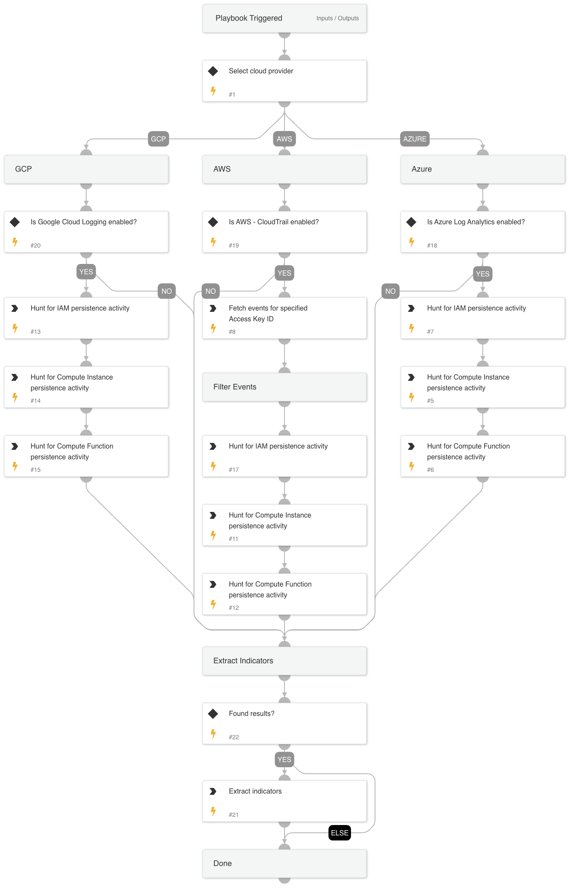

## Cloud Threat Hunting - Persistence Playbook

The playbook is responsible for hunting persistence activity in the cloud. It supports AWS, GCP, and Azure - one at a time.

### Hunting Queries

The playbook executes hunting queries for each provider related to each of the following:

1. IAM
2. Compute Resources
3. Compute Functions

### Indicator Extraction

If relevant events are found during the search, indicators will be extracted using the `ExtractIndicators-CloudLogging` script.

## Dependencies

This playbook uses the following sub-playbooks, integrations, and scripts.

### Sub-playbooks

This playbook does not use any sub-playbooks.

### Integrations

This playbook does not use any integrations.

### Scripts

* IsIntegrationAvailable
* Set
* ExtractIndicators-CloudLogging

### Commands

* gcp-logging-log-entries-list
* aws-cloudtrail-lookup-events
* azure-log-analytics-execute-query

## Playbook Inputs

---

| **Name** | **Description** | **Default Value** | **Required** |
| --- | --- | --- | --- |
| cloudProvider | The cloud service provider involved. The supported CSPs are AWS, Azure and GCP. |  | Optional |
| AWSAccessKeyID | The AWS access key ID. |  | Optional |
| username | The username that initiated the API call. |  | Optional |
| region | The region to search for events in. e.g. us-east-1, us-west-2, etc. |  | Optional |
| AzureTimespan | The timespan to limit by the hunting query. e.g., Use 2d for timespan of 2 days Use 1.5h for timespan of 1.5 hour Use 30m for timespan of 30 minutes |  | Optional |
| AWSTimespan | Date and time in the following format - yyyy-mm-ddThh:mm:ss e.g., 2022-05-29T12:00:00 2021-01-01T12:00:00 |  | Optional |
| GCPTimespan | Date in ISO. e.g. 2022-05-29T12:00:00.123Z 2021-01-01T12:00:00.234Z |  | Optional |
| GCPProjectName | The GCP project name. |  | Optional |

## Playbook Outputs

---

| **Path** | **Description** | **Type** |
| --- | --- | --- |
| CloudIndicators.arn | The ARN. | unknown |
| CloudIndicators.access_key_id | The AWS access key ID. | unknown |
| CloudIndicators.resource_name | The resource name. | unknown |
| CloudIndicators.source_ip | The source IP. | unknown |
| CloudIndicators.username | The username used by the attacker. | unknown |
| CloudIndicators.event_name | The name of the event. | unknown |
| CloudIndicators.user_agent | The user agent used by the attacker. | unknown |

## Playbook Image

---

