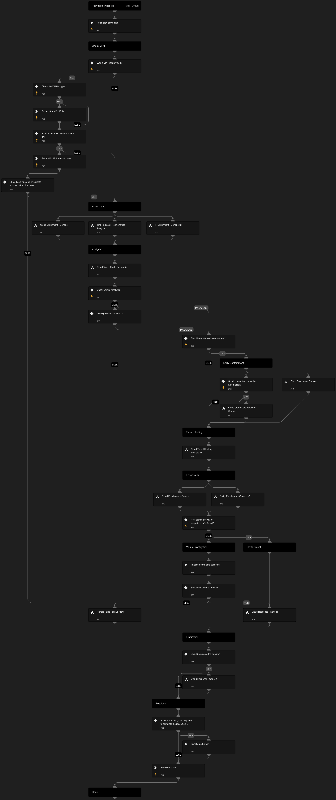

---

## Cloud Token Theft Response Playbook

The **Cloud Token Theft Response Playbook** provides a structured and comprehensive flow to effectively respond to and mitigate alerts involving the theft of cloud tokens. The playbook supports AWS, GCP, and Azure and executes the following:

**Cloud Enrichment:**
- Enriches the involved resources
- Enriches the involved identities
- Enriches the involved IPs

**Verdict Decision Tree:**
- Determines the appropriate verdict based on the investigation findings

**Early Containment using the Cloud Response - Generic Playbook:**
- Implements early containment measures to prevent further impact

**Cloud Persistence Threat Hunting:**
- Conducts threat hunting activities to identify any cloud persistence techniques

**Enriching and Responding to Hunting Findings:**
- Performs additional enrichment and responds to the findings from threat hunting

**Verdict Handling:**
- Handles false positives identified during the investigation
- Handles true positives by initiating appropriate response actions

### Supported Alerts

| Alert Name                                          | CSP   |
|----------------------------------------------------|-------|
| Suspicious usage of AWS Lambda’s token              | AWS   |
| Suspicious usage of AWS Lambda’s role               | AWS   |
| Suspicious usage of EC2 token                       | AWS   |
| Remote usage of an AWS service token                | AWS   |
| Remote usage of an AWS EKS token                    | AWS   |
| Suspicious usage of an AWS EKS token                | AWS   |
| Suspicious usage of an AWS ECS token                | AWS   |
| Remote usage of an AWS ECS token                    | AWS   |
| Suspicious usage of AWS service token               | AWS   |
| Remote usage of an App engine Service Account token | GCP   |
| Suspicious usage of App engine Service Account token| GCP   |
| Remote usage of VM Service Account token            | GCP   |
| Suspicious usage of VM Service Account toke         | GCP   |

---

## Dependencies

This playbook uses the following sub-playbooks, integrations, and scripts.

### Sub-playbooks

* Cloud Response - Generic
* Handle False Positive Alerts
* TIM - Indicator Relationships Analysis
* Entity Enrichment - Generic v3
* Cloud Threat Hunting - Persistence
* IP Enrichment - Generic v2
* Cloud Token Theft - Set Verdict
* Cloud Enrichment - Generic

### Integrations

This playbook does not use any integrations.

### Scripts

* LoadJSON
* ParseHTMLIndicators

### Commands

* core-get-cloud-original-alerts
* setAlert
* closeInvestigation

## Playbook Inputs

---

| **Name** | **Description** | **Default Value** | **Required** |
| --- | --- | --- | --- |
| alert_id | The alert ID. | alert.investigationId | Optional |
| InternalRange | A list of internal IP ranges to check IP addresses against. The list should be provided in CIDR notation, separated by commas. |  | Optional |
| ResolveIP | Determines whether to convert the IP address to a hostname using a DNS query \(True/ False\). | True | Optional |
| earlyContainment | Whether to execute early containment. This action allows you to respond rapidly but have higher probability for false positives. | False | Optional |
| VPNIPList | This input can process to types of data: 1. A comma separated list of IP addresses assigned by the VPN provider. \(using a XSIAM list or an hardcoded array\) 2. A comma separated list of CIDRs. 3. A link to an IP addresses list which will be processed and extract the IP dynamically with each execution.  |  | Optional |

## Playbook Outputs

---
There are no outputs for this playbook.

## Playbook Image

---

