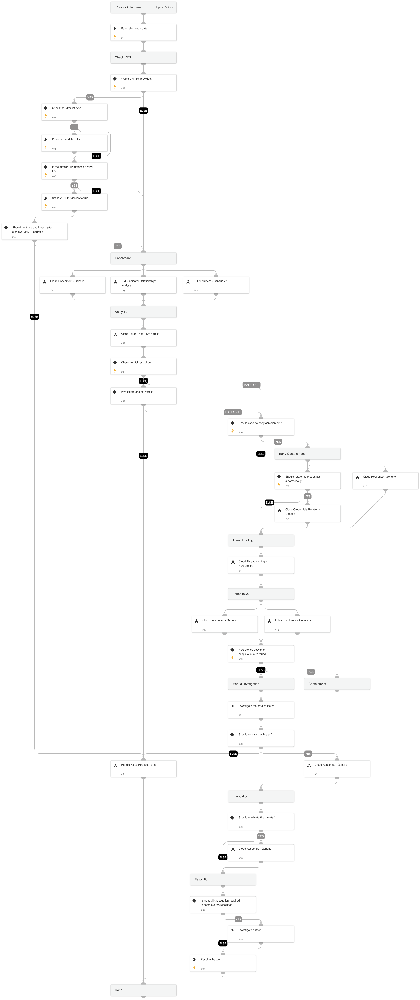

---

## Cloud Token Theft Response Playbook

The **Cloud Token Theft Response Playbook** provides a structured and comprehensive flow to effectively respond to and mitigate alerts involving the theft of cloud tokens. The playbook supports AWS, GCP, and Azure and executes the following:

**Cloud Enrichment:**
- Enriches the involved resources
- Enriches the involved identities
- Enriches the involved IPs

**Verdict Decision Tree:**
- Determines the appropriate verdict based on the investigation findings

**Early Containment using the Cloud Response - Generic Playbook:**
- Implements early containment measures to prevent further impact

**Cloud Persistence Threat Hunting:**
- Conducts threat hunting activities to identify any cloud persistence techniques

**Enriching and Responding to Hunting Findings:**
- Performs additional enrichment and responds to the findings from threat hunting

**Verdict Handling:**
- Handles false positives identified during the investigation
- Handles true positives by initiating appropriate response actions

---

## Dependencies

This playbook uses the following sub-playbooks, integrations, and scripts.

### Sub-playbooks

* Handle False Positive Alerts
* Cloud Token Theft - Set Verdict
* Cloud Threat Hunting - Persistence
* Cloud Enrichment - Generic
* Cloud Credentials Rotation - Generic
* Entity Enrichment - Generic v3
* IP Enrichment - Generic v2
* TIM - Indicator Relationships Analysis
* Cloud Response - Generic

### Integrations

This playbook does not use any integrations.

### Scripts

* ParseHTMLIndicators

### Commands

* closeInvestigation
* core-get-cloud-original-alerts
* setAlert

## Playbook Inputs

---

| **Name** | **Description** | **Default Value** | **Required** |
| --- | --- | --- | --- |
| alert_id | The alert ID. | alert.investigationId | Optional |
| InternalRange | A list of internal IP ranges to check IP addresses against. The comma-separated list should be provided in CIDR notation. | lists.PrivateIPs | Optional |
| ResolveIP | Determines whether to convert the IP address to a hostname using a DNS query \(True/ False\). | True | Optional |
| earlyContainment | Whether to execute early containment. This action allows you to respond rapidly but have higher probability for false positives. | False | Optional |
| VPNIPList | This input can process to types of data: 1. A comma separated list of IP addresses assigned by the VPN provider. \(using a XSIAM list or an hardcoded array\) 2. A comma separated list of CIDRs. 3. A link to an IP addresses list which will be processed and extract the IP dynamically with each execution.  |  | Optional |
| AWS-newInstanceProfileName | The new instance profile name to assign in the clone service account flow. |  | Optional |
| AWS-newRoleName | The new role name to assign in the clone service account flow. |  | Optional |
| AWS-roleNameToRestrict | If provided, the role will be attached with a deny policy without the compute instance analysis flow. |  | Optional |
| shouldCloneSA | Whether to clone the compromised SA before putting a deny policy to it. Supports: AWS. True/False | False | Optional |
| autoCredentialsRotation | Whether to rotate the identity credentials automatically. | False | Optional |
| credentialsRemediationType | The response playbook provides the following remediation actions using AWS, MSGraph Users, GCP and GSuite Admin:  Reset: By entering "Reset" in the input, the playbook will execute password reset. Supports: AWS, MSGraph Users, GCP and GSuite Admin.  Revoke: By entering "Revoke" in the input, the GCP will revoke the access key, GSuite Admin will revoke the access token and the MSGraph Users will revoke the session. Supports: GCP, GSuite Admin and MSGraph Users.  Deactivate - By entering "Deactivate" in the input, the playbook will execute access key deactivation. Supports: AWS.  ALL: By entering "ALL" in the input, the playbook will execute the all remediation actions provided for each CSP. | Reset | Optional |

## Playbook Outputs

---
There are no outputs for this playbook.

## Playbook Image

---

