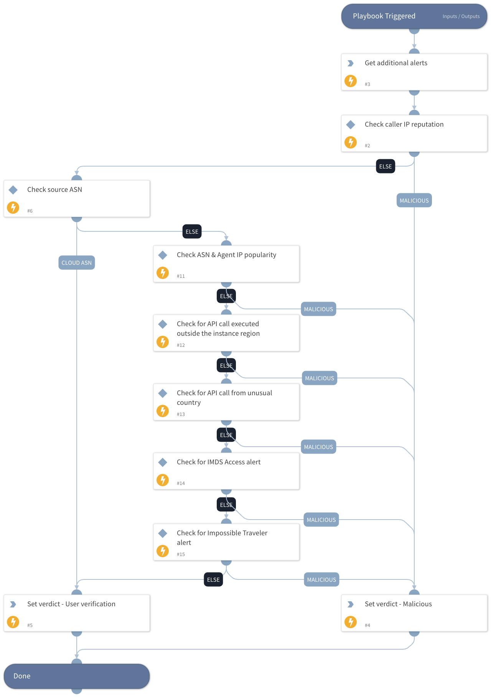

---

## Cloud Token Theft  - Set Verdict Playbook

The playbook is built from a decision tree whose ultimate goal is to decide whether the observed activity is malicious.

### Event Search

The playbook searches for events based on the attacker's IP address within the last two hours.

### Tests Performed

The following tests are performed on the observed activity:

1. **Malicious IP Check**: Determines if the IP address is malicious.
2. **CSP ASN Check**: Checks if the activity was performed from an Autonomous System Number (ASN) belonging to one of the Cloud Service Providers (CSPs).
3. **IP and ASN History Check**: Verifies if the IP address and ASN have been previously observed.
4. **Region Check**: Determines if the API call was made from outside the recognized region.
5. **Anomalous State Check**: Checks if the API call was made from an anomalous state.
6. **Alert Check**: Looks for any related alerts around the event, including:
   - Possible cloud instance metadata service (IMDS) abuse.
   - Impossible Traveler by cloud identity.

---

## Dependencies

This playbook uses the following sub-playbooks, integrations, and scripts.

### Sub-playbooks

This playbook does not use any sub-playbooks.

### Integrations

This playbook does not use any integrations.

### Scripts

* Set

### Commands

* xdr-get-incident-extra-data

## Playbook Inputs

---
There are no inputs for this playbook.

## Playbook Outputs

---

| **Path** | **Description** | **Type** |
| --- | --- | --- |
| alertVerdict | The alert verdict. | unknown |
| PaloAltoNetworksXDR.Alert | The additional alerts found. | unknown |

## Playbook Image

---

