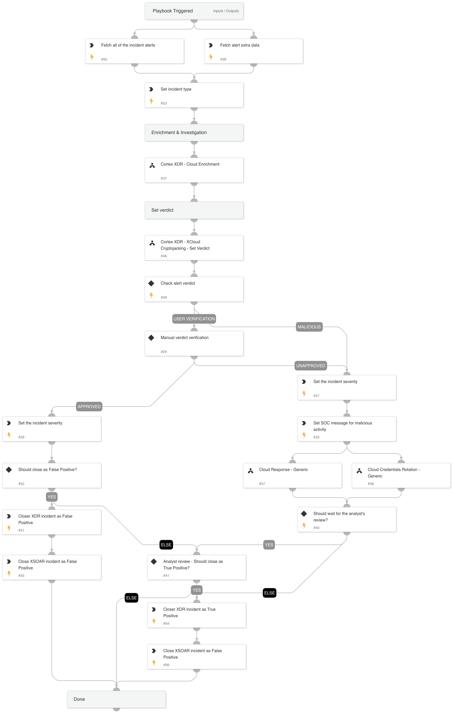

Investigates a Cortex XDR incident containing a Cloud Cryptojacking related alert. 
The playbook supports AWS, Azure, and GCP and executes the following:

- Cloud enrichment:
   - Collects info about the involved resources
   - Collects info about the involved identities
   - Collects info about the involved IPs
- Verdict decision tree
- Verdict handling:
   - Handle False Positives
   - Handle True Positives
      - Cloud Response - Generic sub-playbook.
- Notifies the SOC if a malicious verdict was found

## Dependencies

This playbook uses the following sub-playbooks, integrations, and scripts.

### Sub-playbooks

* Cortex XDR - XCloud Cryptojacking - Set Verdict
* Cortex XDR - Cloud Enrichment
* Cloud Credentials Rotation - Generic
* Cloud Response - Generic

### Integrations

This playbook does not use any integrations.

### Scripts

* IncreaseIncidentSeverity

### Commands

* send-mail
* setIncident
* xdr-get-cloud-original-alerts
* xdr-update-incident
* xdr-get-incident-extra-data
* closeInvestigation

## Playbook Inputs

---

| **Name** | **Description** | **Default Value** | **Required** |
| --- | --- | --- | --- |
| SOCEmailAddress | The SOC email address to use for the alert status notification. |  | Optional |
| requireAnalystReview | Whether to require an analyst review after the alert remediation. | True | Optional |
| incident_id | The incident ID. |  | Optional |
| alert_id | The alert ID. |  | Optional |
| cloudProvider | The cloud service provider involved. | PaloAltoNetworksXDR.OriginalAlert.event.cloud_provider | Optional |
| ResolveIP | Determines whether to convert the IP address to a hostname using a DNS query \(True/ False\). | True | Optional |
| InternalRange | A list of internal IP ranges to check IP addresses against.  For IP Enrichment - Generic v2 playbook. | lists.PrivateIPs | Optional |
| autoBlockIndicators | Whether to block the indicators automatically. | False | Optional |
| autoAccessKeyRemediation | Whether to execute the user remediation flow automatically. | False | Optional |
| autoResourceRemediation | Whether to execute the resource remediation flow automatically. | False | Optional |
| autoUserRemediation | Whether to execute the user remediation flow automatically. | False | Optional |
| credentialsRemediationType | The response playbook provides the following remediation actions using AWS, MSGraph Users, GCP and GSuite Admin:  Reset: By entering "Reset" in the input, the playbook will execute password reset. Supports: AWS, MSGraph Users, GCP and GSuite Admin.  Revoke: By entering "Revoke" in the input, the GCP will revoke the access key, GSuite Admin will revoke the access token and the MSGraph Users will revoke the session. Supports: GCP, GSuite Admin and MSGraph Users.  Deactivate - By entering "Deactivate" in the input, the playbook will execute access key deactivation. Supports: AWS.  ALL: By entering "ALL" in the input, the playbook will execute the all remediation actions provided for each CSP. | Reset | Optional |
| AWS-accessKeyRemediationType | Choose the remediation type for the user's access key.  AWS available types: Disable - for disabling the user's access key. Delete - for the user's access key deletion. | Disable | Optional |
| AWS-resourceRemediationType | Choose the remediation type for the instances created.  AWS available types: Stop - for stopping the instances. Terminate - for terminating the instances. | Stop | Optional |
| AWS-userRemediationType | Choose the remediation type for the user involved.  AWS available types: Delete - for the user deletion. Revoke - for revoking the user's credentials. | Revoke | Optional |
| AWS-newRoleName | The name of the new role to create if the analyst decides to clone the service account. |  | Optional |
| AWS-newInstanceProfileName | The name of the new instance profile to create if the analyst decides to clone the service account. |  | Optional |
| AWS-roleNameToRestrict | If provided, the role will be attached with a deny policy without the compute instance analysis flow. |  | Optional |
| shouldCloneSA | Whether to clone the compromised SA before putting a deny policy to it. True/False | True | Optional |
| Azure-resourceRemediationType | Choose the remediation type for the instances created.  Azure available types: Poweroff - for shutting down the instances. Delete - for deleting the instances. | Poweroff | Optional |
| Azure-userRemediationType | Choose the remediation type for the user involved.  Azure available types: Disable - for disabling the user. Delete - for deleting the user. | Disable | Optional |
| GCP-accessKeyRemediationType | Choose the remediation type for the user's access key.  GCP available types: Disable - For disabling the user's access key. Delete - For the deleting user's access key. | Disable | Optional |
| GCP-resourceRemediationType | Choose the remediation type for the instances created.  GCP available types: Stop - For stopping the instances. Delete - For deleting the instances. | Stop | Optional |
| GCP-userRemediationType | Choose the remediation type for the user involved.  GCP available types: Delete - For deleting the user. Disable - For disabling the user. | Disable | Optional |

## Playbook Outputs

---
There are no outputs for this playbook.

## Playbook Image

---

