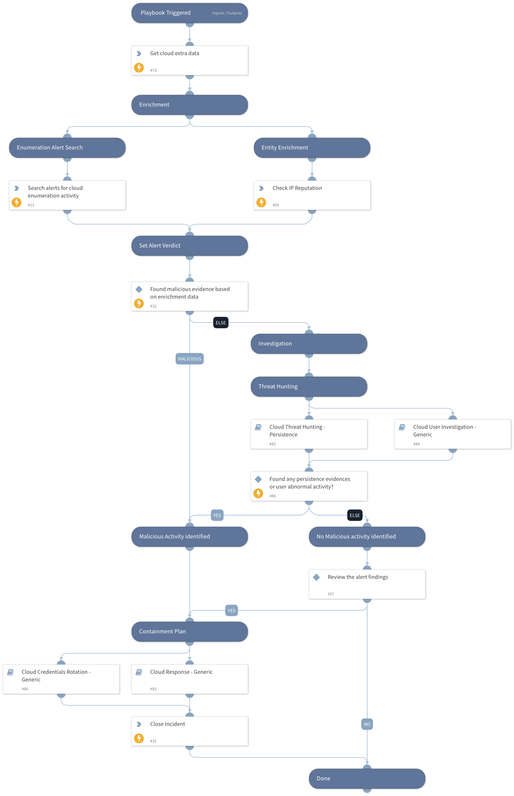

## Data Exfiltration Response

The Data Exfiltration Response playbook is designed to address data exfiltration activity alerts in the cloud environment. This playbook is intended for handling "An identity performed a suspicious download of multiple cloud storage object" alert.
The playbook supports AWS, GCP, and Azure and executes the following:
- Enrichment involved assets. 
- Determines the appropriate verdict based on the data collected from the enrichment phase. 
- Cloud Persistence Threat Hunting:
  - Conducts threat hunting activities to identify any cloud persistence techniques
- Verdict Handling:
  - Handles false positives identified during the investigation
  - Handles true positives by initiating appropriate response actions

## Dependencies

This playbook uses the following sub-playbooks, integrations, and scripts.

### Sub-playbooks

* Cloud User Investigation - Generic
* Cloud Threat Hunting - Persistence
* Cloud Response - Generic

### Commands

* ip
* xdr-get-cloud-original-alerts
* xdr-get-alerts
* closeInvestigation

## Playbook Inputs

---

| **Name** | **Description** | **Default Value** | **Required** |
| --- | --- | --- | --- |
| alertID | The XDR alert ID |  | Optional |
| autoResourceRemediation | Whether to execute the resource remediation automatically. \(Default: False\) | False | Optional |
| autoAccessKeyRemediation | Whether to execute the access key remediation automatically. \(Default: False\) | False | Optional |
| autoUserRemediation | Whether to execute the user remediation automatically. \(Default: False\) | False | Optional |
| autoBlockIndicators | Whether to execute the block remediation automatically. \(Default: False\) | False | Optional |

## Playbook Outputs

---
There are no outputs for this playbook.

## Playbook Image

---

