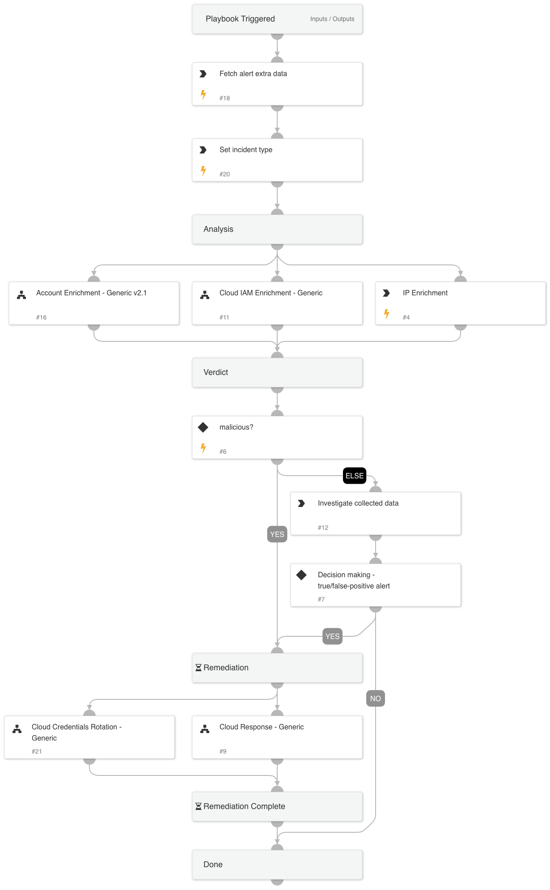

Investigate and respond to Cortex XDR Cloud alerts where a Cloud IAM user`s access key is used suspiciously to access the cloud environment. 
The following alerts are supported for AWS, Azure, and GCP environments.
- Penetration testing tool attempt
- Penetration testing tool activity
- Suspicious API call from a Tor exit node

## Dependencies

This playbook uses the following sub-playbooks, integrations, and scripts.

### Sub-playbooks

* Cloud Response - Generic
* Cloud IAM Enrichment - Generic
* Cloud Credentials Rotation - Generic
* Account Enrichment - Generic v2.1

### Integrations

This playbook does not use any integrations.

### Scripts

This playbook does not use any scripts.

### Commands

* ip
* setIncident
* xdr-get-cloud-original-alerts

## Playbook Inputs

---

| **Name** | **Description** | **Default Value** | **Required** |
| --- | --- | --- | --- |
| alert_id | The alert ID. |  | Optional |
| cloudProvider | The CSP that triggered the alert. Usually mapped to incident field named 'cloudprovider'. e.g. AWS, AZURE, GCP |  | Optional |
| autoAccessKeyRemediation | Whether to execute the user remediation flow automatically. | False | Optional |
| autoBlockIndicators | Whether to block the indicators automatically. | False | Optional |
| autoUserRemediation | Whether to execute the user remediation flow automatically. | False | Optional |
| credentialsRemediationType | The response playbook provides the following remediation actions using AWS, MSGraph Users, GCP and GSuite Admin:  Reset: By entering "Reset" in the input, the playbook will execute password reset. Supports: AWS, MSGraph Users, GCP and GSuite Admin.  Revoke: By entering "Revoke" in the input, the GCP will revoke the access key, GSuite Admin will revoke the access token and the MSGraph Users will revoke the session. Supports: GCP, GSuite Admin and MSGraph Users.  Deactivate - By entering "Deactivate" in the input, the playbook will execute access key deactivation. Supports: AWS.  ALL: By entering "ALL" in the input, the playbook will execute the all remediation actions provided for each CSP. |  | Optional |
| identityType | The type of identity involved. Usually mapped to incident field named 'cloudidentitytype'. e.g. IAM,SERVICE_ACCOUNT,APPLICATION |  | Optional |
| AWS-accessKeyRemediationType | Choose the remediation type for the user's access key.  AWS available types: Disable - for disabling the user's access key. Delete - for deleting the user's access key. | Disable | Optional |
| AWS-userRemediationType | Choose the remediation type for the user involved.  AWS available types: Delete - for the user deletion. Revoke - for revoking the user's credentials. | Revoke | Optional |
| AWS-instanceID | The instance ID. |  | Optional |
| AWS-userID | The user name. |  | Optional |
| AWS-accessKeyID | The access key ID. |  | Optional |
| AWS-newRoleName | The name of the new role to create if the analyst decides to clone the service account. |  | Optional |
| AWS-newInstanceProfileName | The name of the new instance profile to create if the analyst decides to clone the service account. |  | Optional |
| AWS-roleNameToRestrict | If provided, the role will be attached with a deny policy without the compute instance analysis flow. |  | Optional |
| Azure-userRemediationType | Choose the remediation type for the user involved.  Azure available types: Disable - for disabling the user. Delete - for deleting the user. | Disable | Optional |
| Azure-AppID | This is the unique application \(client\) ID of the application. |  | Optional |
| Azure-ObjectID | This is the unique ID of the service principal object associated with the application. |  | Optional |
| Azure-userID | The user ID or user principal name. |  | Optional |
| GCP-accessKeyRemediationType | Choose the remediation type for the user's access key.  GCP available types: Disable - For disabling the user's access key. Delete - For deleting the user's access key. | Disable | Optional |
| GCP-userRemediationType | Choose the remediation type for the user involved.  GCP available types: Delete - For deleting the user. Disable - For disabling the user. | Disable | Optional |
| GCP-userID | Identifies the user in the API request. The value can be the user's primary email address, alias email address, or unique user ID. |  | Optional |
| GCP-clientID | The client ID. |  | Optional |
| GCP-zone | The name of the zone. e.g. us-central1-c us-central1-b |  | Optional |
| GCP-SAEmail | The service account email. |  | Optional |
| GCP-cloudProject | The project that the alert was triggered on. |  | Optional |

## Playbook Outputs

---
There are no outputs for this playbook.

## Playbook Image

---

