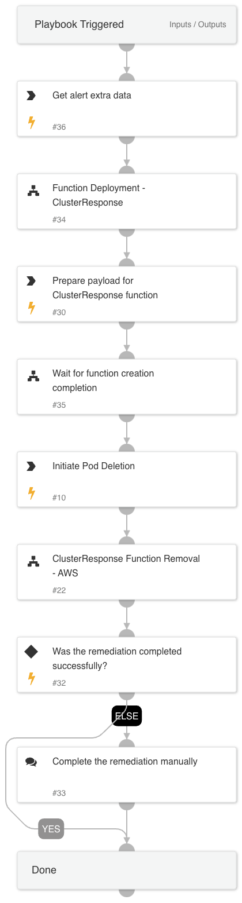

This playbook ensures a swift and effective response to malicious activities within Kubernetes environments, leveraging cloud-native tools to maintain cluster security and integrity.

The playbook is designed to handle agent-generated alerts due to malicious activities within Kubernetes (K8S) pods, such as mining activities, which require immediate action. The playbook also addresses scenarios where the malicious pod is killed, but the malicious K8S workload repeatedly creates new pods.

### Key Features:

AWS Function Integration: This utilizes an AWS Lambda function that can manage resources and facilitate rapid response actions within an Amazon EKS cluster without the need for third-party tools such as Kubectl.

The Lambda function can initiate the following response actions:

    - Pod Termination: The playbook includes steps to safely terminate the affected pod within the K8S environment.
    - Workload Suspension: If necessary, the playbook can be escalated to suspend the entire workload associated with the mining activity.

Once the Lambda function execution is completed, the playbook deletes all of the created objects to ensure undesirable usage.

### Workflow:

1. Alert Detection: The playbook begins with the monitoring agent detecting a mining alert within a Kubernetes pod.
2. Alert Validation: Validates the alert to ensure it is not a false positive.
3. Response Decision: 
    - Pod Termination: If the mining activity is isolated to a single pod, the AWS Lambda function is invoked to terminate the affected pod within the K8S environment.
    - Workload Suspension: If the mining activity is widespread or poses a significant threat, the AWS Lambda function suspends the entire workload within the K8S environment.
4. Cleanup: This action initiates the complete removal of all objects created for the Lambda execution for security and hardening purposes.

## Dependencies

This playbook uses the following sub-playbooks, integrations, and scripts.

### Sub-playbooks

* GenericPolling
* Function Deployment - AWS
* Function Removal - AWS

### Integrations

#### AWS IAM (Identity and Access Management)
- [AWS IAM API Documentation](https://docs.aws.amazon.com/IAM/latest/APIReference/Welcome.html)
- [Cortex XSOAR AWS IAM Integration](https://cortex.marketplace.pan.dev/marketplace/details/AWSIAM/)

#### AWS EC2 (Elastic Compute Cloud)
- [AWS EC2 API Documentation](https://docs.aws.amazon.com/AWSEC2/latest/APIReference/Welcome.html)
- [Cortex XSOAR AWS EC2 Integration](https://cortex.marketplace.pan.dev/marketplace/details/AWSEC2/)

#### AWS EKS (Elastic Kubernetes Service)
- [AWS EKS API Documentation](https://docs.aws.amazon.com/eks/latest/APIReference/Welcome.html)
- [Cortex XSOAR AWS EKS Integration](https://cortex.marketplace.pan.dev/marketplace/details/AWSEKS/)

#### AWS Lambda
- [AWS Lambda API Documentation](https://docs.aws.amazon.com/lambda/latest/dg/API_Reference.html)
- [Cortex XSOAR AWS Lambda Integration](https://xsoar.pan.dev/docs/reference/integrations/aws---lambda)

### Commands

* aws-lambda-invoke
* xdr-get-cloud-original-alerts

## Playbook Inputs

---

| **Name** | **Description** | **Default Value** | **Required** |
| --- | --- | --- | --- |
| ClusterName | The name of the cluster. |  | Optional |
| region | The resource region. |  | Optional |
| AlertID | The alert id. |  | Optional |

## Playbook Outputs

---
There are no outputs for this playbook.

## Playbook Image

---

