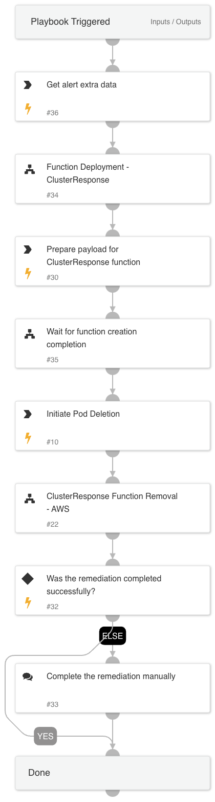

This playbook ensures a swift and effective response to malicious activities within Kubernetes environments, leveraging cloud-native tools to maintain cluster security and integrity.

The playbook is designed to handle agent-generated alerts due to malicious activities within Kubernetes (K8S) pods, such as mining activities, which requires immediate action. The playbook also addresses scenarios where the malicious pod is killed, but the malicious K8S workload repeatedly creates new pods.

Key Features:

1. Trigger: The playbook is activated when an agent-based mining alert is detected within a Kubernetes pod.
2. AWS Function Integration: Utilizes an AWS Lambda function to facilitate rapid response actions.
3. K8S Environment Remediation: 
    - Pod Termination: The playbook includes steps to terminate the affected pod within the K8S environment safely.
    - Workload Suspension: If necessary, the playbook can be escalated to suspend the entire workload associated with the mining activity.

Workflow:

1. Alert Detection: The playbook begins with the monitoring agent detecting a mining alert within a Kubernetes pod.
2. Alert Validation: Validates the alert to ensure it is not a false positive.
3. Response Decision: 
    - Pod Termination: If the mining activity is isolated to a single pod, the AWS Lambda function is invoked to terminate the affected pod within the K8S environment.
    - Workload Suspension: If the mining activity is widespread or poses a significant threat, the AWS Lambda function suspends the entire workload within the K8S environment.
4. Cleanup: Initiates a complete removal of all objects created for the Lambda execution for security and hardening purposes.

## Dependencies

This playbook uses the following sub-playbooks, integrations, and scripts.

### Sub-playbooks

* Function Removal - AWS
* Function Deployment - AWS
* GenericPolling

### Integrations

This playbook does not use any integrations.

### Scripts

* Set

### Commands

* aws-lambda-invoke
* xdr-get-cloud-original-alerts

## Playbook Inputs

---

| **Name** | **Description** | **Default Value** | **Required** |
| --- | --- | --- | --- |
| ClusterName | The name of the cluster. |  | Optional |
| region | The resource region. |  | Optional |
| AlertID | The alert id. |  | Optional |

## Playbook Outputs

---
There are no outputs for this playbook.

## Playbook Image

---

