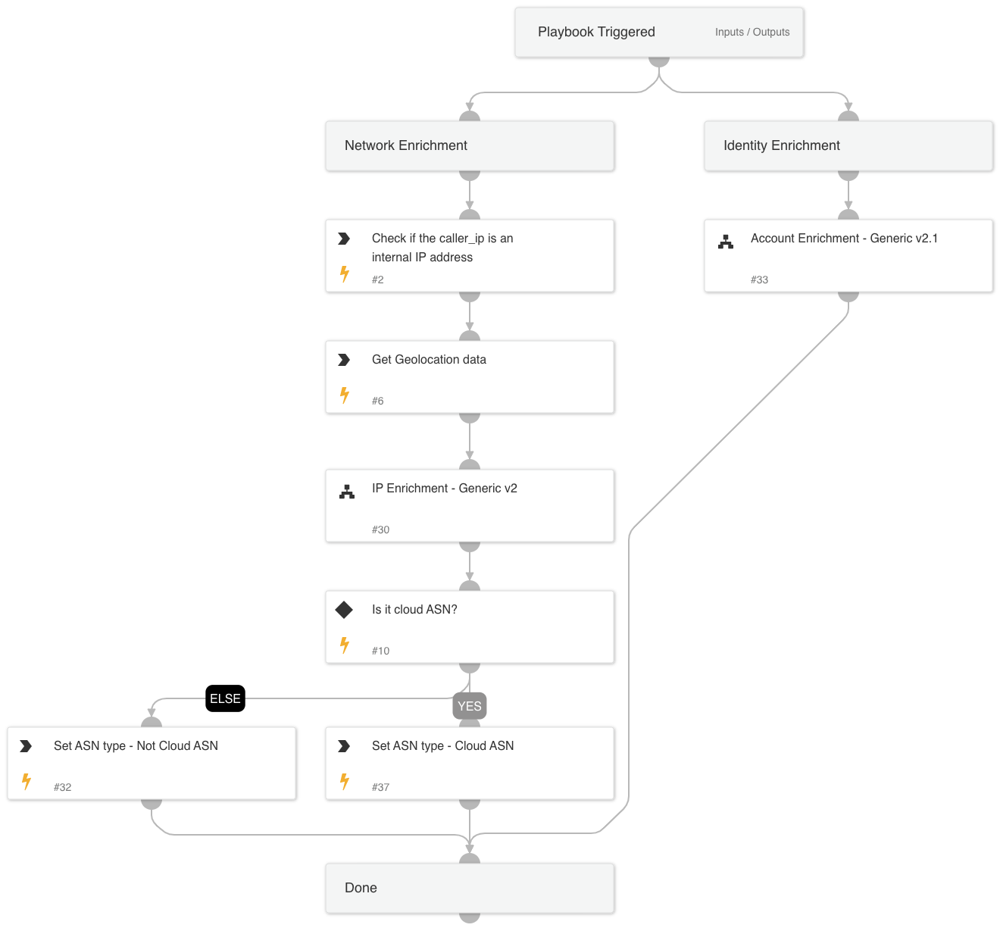

This playbook is responsible for data collection and enrichment.

The playbook collects or enriches the following data:

- Account enrichment

- Network enrichment

   -Attacker IP

   -Geolocation

   -ASN

## Dependencies
This playbook uses the following sub-playbooks, integrations, and scripts.

### Sub-playbooks
* Account Enrichment - Generic v2.1
* IP Enrichment - Generic v2

### Integrations
* CoreIOCs
* CortexCoreIR

### Scripts
* IsInCidrRanges
* Set

### Commands
* ip

## Playbook Inputs
---

| **Name** | **Description** | **Default Value** | **Required** |
| --- | --- | --- | --- |
| ResolveIP | Determines whether to convert the IP address to a hostname using a DNS query \(True/ False\). | True | Optional |
| InternalRange | A list of internal IP ranges to check IP addresses against.  For IP Enrichment - Generic v2 playbook. |  | Optional |

## Playbook Outputs
---

| **Path** | **Description** | **Type** |
| --- | --- | --- |
| IP | The IP objects | unknown |
| DBotScore | Indicator, Score, Type, Vendor | unknown |
| Account | The account object. | unknown |
| IAM | Generic IAM output. | unknown |
| UserManagerEmail | The email of the user's manager. | unknown |
| UserManagerDisplayName | The display name of the user's manager. | unknown |
| MSGraphUser | The MSGraphUser object. | unknown |
| MSGraphUserManager.Manager | The MSGrMSGraphUserManageraph Manager object. | unknown |
| SailPointIdentityNow | The SailPointIdentityNow object. | unknown |
| SailPointIdentityNow.Account | The IdentityNow account object. | unknown |
| IdentityIQ | The IdentityIQ object. | unknown |
| ActiveDirectory.Users | The ActiveDirectory Users object. | unknown |

## Playbook Image
---
