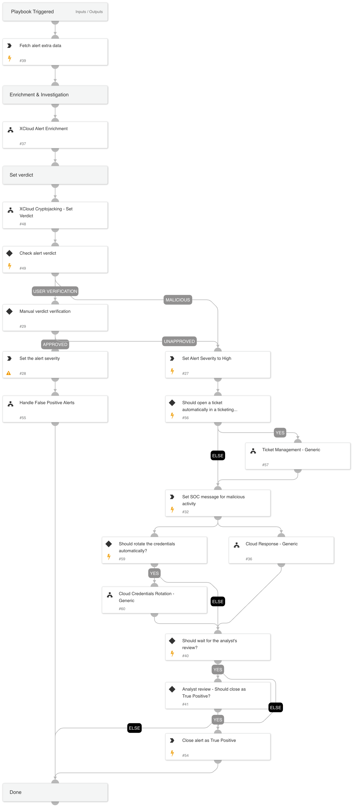

Investigates a Cortex XDR incident containing Cloud Cryptojacking related alert. 
The playbook supports AWS, Azure, and GCP and executes the following:

- Cloud enrichment:

    -Collects info about the involved resources

    -Collects info about the involved identities

    -Collects info about the involved IPs

- Verdict decision tree

- Verdict handling:

 -Handle False Positives

 -Handle True Positives

 -Cloud Response - Generic sub-playbook.

- Notifies the SOC if a malicious verdict was found

## Dependencies

This playbook uses the following sub-playbooks, integrations, and scripts.

### Sub-playbooks

* XCloud Alert Enrichment
* Cloud Credentials Rotation - Generic
* Ticket Management - Generic
* Cloud Response - Generic
* XCloud Cryptojacking - Set Verdict
* Handle False Positive Alerts

### Integrations

This playbook does not use any integrations.

### Scripts

* IncreaseIncidentSeverity
* LoadJSON

### Commands

* closeInvestigation
* send-mail
* core-get-cloud-original-alerts
* setParentIncidentFields

## Playbook Inputs

---

| **Name** | **Description** | **Default Value** | **Required** |
| --- | --- | --- | --- |
| SOCEmailAddress | The SOC email address to use for the alert status notification. |  | Optional |
| requireAnalystReview | Whether to require an analyst review after the alert remediation. | True | Optional |
| ShouldCloseAutomatically | Should we automatically close false positive alerts? Specify true/false. | False | Optional |
| ShouldHandleFPautomatically | Should we automatically handle false positive alerts? Specify true/false. | False | Optional |
| cloudProvider | The cloud service provider involved. | alert.cloudprovider | Optional |
| alert_id | The alert ID. |  | Optional |
| ResolveIP | Determines whether to convert the IP address to a hostname using a DNS query \(True/ False\). | True | Optional |
| InternalRange | A list of internal IP ranges to check IP addresses against.  For IP Enrichment - Generic v2 playbook. | lists.PrivateIPs | Optional |
| autoAccessKeyRemediation | Whether to execute the user remediation flow automatically. | False | Optional |
| autoBlockIndicators | Whether to block the indicators automatically. | False | Optional |
| autoResourceRemediation | Whether to execute the resource remediation flow automatically. | False | Optional |
| autoUserRemediation | Whether to execute the user remediation flow automatically. | False | Optional |
| credentialsRemediationType | The response playbook provides the following remediation actions using AWS, MSGraph Users, GCP and GSuite Admin:  Reset: By entering "Reset" in the input, the playbook will execute password reset. Supports: AWS, MSGraph Users, GCP and GSuite Admin.  Revoke: By entering "Revoke" in the input, the GCP will revoke the access key, GSuite Admin will revoke the access token and the MSGraph Users will revoke the session. Supports: GCP, GSuite Admin and MSGraph Users.  Deactivate - By entering "Deactivate" in the input, the playbook will execute access key deactivation. Supports: AWS.  ALL: By entering "ALL" in the input, the playbook will execute the all remediation actions provided for each CSP. | Reset | Optional |
| AWS-accessKeyRemediationType | Choose the remediation type for the user's access key.  AWS available types: Disable - for disabling the user's access key. Delete - for the user's access key deletion. | Disable | Optional |
| AWS-resourceRemediationType | Choose the remediation type for the instances created.  AWS available types: Stop - for stopping the instances. Terminate - for terminating the instances. | Stop | Optional |
| AWS-userRemediationType | Choose the remediation type for the user involved.  AWS available types: Delete - for the user deletion. Revoke - for revoking the user's credentials. | Revoke | Optional |
| shouldCloneSA | Whether to clone the compromised SA before putting a deny policy to it. True/False |  | Optional |
| AWS-newRoleName | The name of the new role to create if the analyst decides to clone the service account. |  | Optional |
| AWS-newInstanceProfileName | The name of the new instance profile to create if the analyst decides to clone the service account. |  | Optional |
| AWS-roleNameToRestrict | If provided, the role will be attached with a deny policy without the compute instance analysis flow. |  | Optional |
| Azure-resourceRemediationType | Choose the remediation type for the instances created.  Azure available types: Poweroff - for shutting down the instances. Delete - for deleting the instances. | Poweroff | Optional |
| Azure-userRemediationType | Choose the remediation type for the user involved.  Azure available types: Disable - for disabling the user. Delete - for deleting the user. | Disable | Optional |
| GCP-accessKeyRemediationType | Choose the remediation type for the user's access key.  GCP available types: Disable - For disabling the user's access key. Delete - For the deleting user's access key. | Disable | Optional |
| GCP-resourceRemediationType | Choose the remediation type for the instances created.  GCP available types: Stop - For stopping the instances. Delete - For deleting the instances. | Stop | Optional |
| GCP-userRemediationType | Choose the remediation type for the user involved.  GCP available types: Delete - For deleting the user. Disable - For disabling the user. | Disable | Optional |
| ShouldOpenTicket | Whether to open a ticket automatically in a ticketing system. \(True/False\). | False | Optional |
| serviceNowShortDescription | A short description of the ticket. | XSIAM Incident ID - ${parentIncidentFields.incident_id} | Optional |
| serviceNowImpact | The impact for the new ticket. Leave empty for ServiceNow default impact. |  | Optional |
| serviceNowUrgency | The urgency of the new ticket. Leave empty for ServiceNow default urgency. |  | Optional |
| serviceNowSeverity | The severity of the new ticket. Leave empty for ServiceNow default severity. |  | Optional |
| serviceNowTicketType | The ServiceNow ticket type. Options are "incident", "problem", "change_request", "sc_request", "sc_task", or "sc_req_item". Default is "incident". |  | Optional |
| serviceNowCategory | The category of the ServiceNow ticket. |  | Optional |
| serviceNowAssignmentGroup | The group to which to assign the new ticket. |  | Optional |
| ZendeskPriority | The urgency with which the ticket should be addressed. Allowed values are "urgent", "high", "normal", or "low". |  | Optional |
| ZendeskRequester | The user who requested this ticket. |  | Optional |
| ZendeskStatus | The state of the ticket. Allowed values are "new", "open", "pending", "hold", "solved", or "closed". |  | Optional |
| ZendeskSubject | The value of the subject field for this ticket. | XSIAM Incident ID - ${parentIncidentFields.incident_id} | Optional |
| ZendeskTags | The array of tags applied to this ticket. |  | Optional |
| ZendeskType | The type of this ticket. Allowed values are "problem", "incident", "question", or "task". |  | Optional |
| ZendeskAssigne | The agent currently assigned to the ticket. |  | Optional |
| ZendeskCollaborators | The users currently CC'ed on the ticket. |  | Optional |
| description | The ticket description. | ${parentIncidentFields.description}. ${parentIncidentFields.xdr_url} | Optional |
| addCommentPerEndpoint | Whether to append a new comment to the ticket for each endpoint in the incident. Possible values: True/False. | True | Optional |
| CommentToAdd | Comment for the ticket. | ${alert.name}. Alert ID: ${alert.id} | Optional |

## Playbook Outputs

---
There are no outputs for this playbook.

## Playbook Image

---

